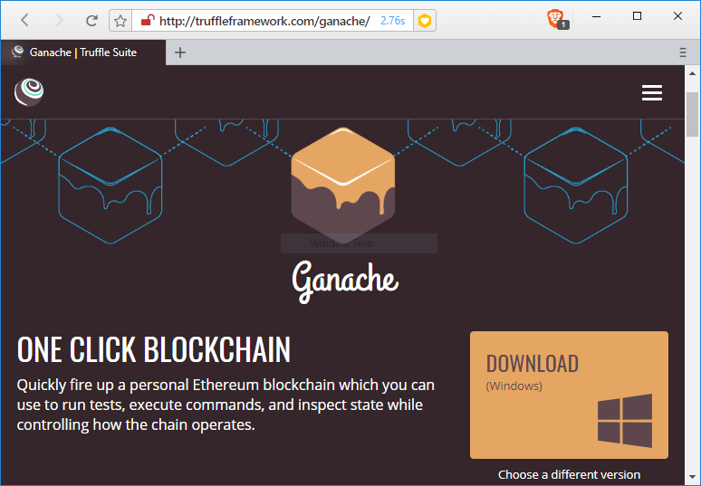
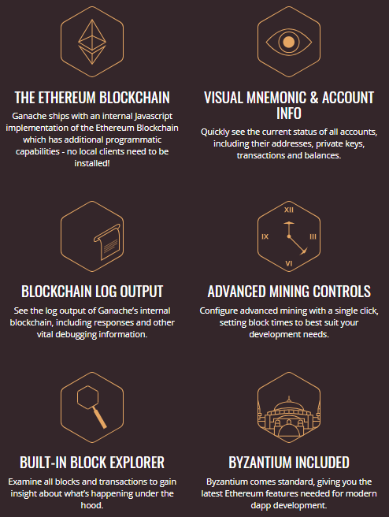
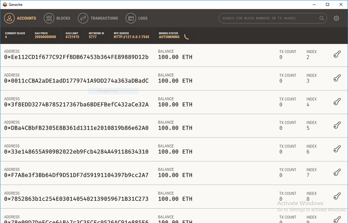
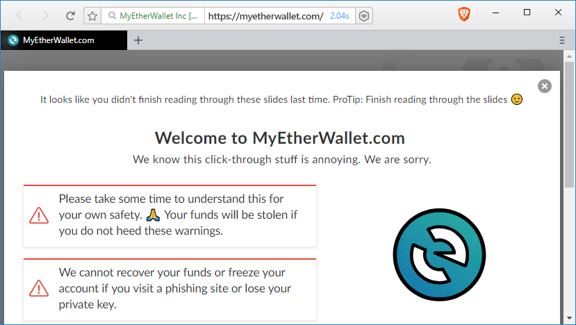
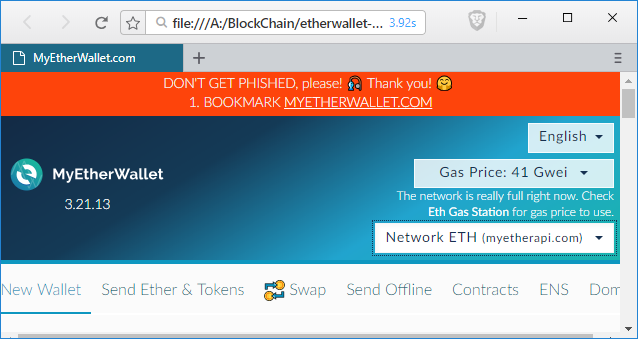

# Create Your  First Smart Contract In Ethereum With Ganache & Remix IDE


Let's create & test your first smart contract on Ethereum Blockchain with simplest approach possible today, we will be using [Ganache](http://truffleframework.com/ganache/), [Remix IDE](https://remix.ethereum.org/) & [MyEtherWallet](https://www.myetherwallet.com/).
We will be using use local instance of ethereum as a private blockchain for th sake of simplicity. Before that a let's have a quick look at Smart Contracts. 

## What is Smart Contract


Above image gives pretty much details about Smart Contracts and it's origin. [Nick Szabo](https://en.wikipedia.org/wiki/Nick_Szabo), who is cryptography genius & legal scholar, has coined the term [Smart Contract](https://en.wikipedia.org/wiki/Smart_contract) back in 1994. He was trying to store and execute legal contracts with the help of cryptography. Since then there has been many implementation of Smart Contract, but nothing was widely accepted and popular like Ethereum Smart Contract.

## Tools Used

Let's understand what above mentioned tools does exactly, and how to use them.

### Ganache

Download and install Ganache from [http://truffleframework.com/ganache/](http://truffleframework.com/ganache/)



Ganache runs a local instance of Ethereum, so we don't need to struggle with Geth command line, along with this we get few accounts created by default, which can be used in development and testing. 
Ganache has built-in block explorer also, so we can easily track all the block and transaction.

Apart from this Ganache has many other useful features which you can see below, according to their website.



After installing, open Ganache you would see this window



You can see here list of accounts along with their address, balance and other information. In header you can see blocks, transaction information etc. Observe  RPC SERVER Address here, with this address you would be interacting with this blockchain.

### Remix IDE

Remix is an online IDE for solidity language, you can access it online at [https://remix.ethereum.org/](https://remix.ethereum.org/). We will use it to write and compile our smart contract code.


### MyEtherWallet

MyEtherWallet is an online wallet & client side interface, which can interact with Ethereum blockchain & perform operations on blockchain.



But here we are using private blockchain running in our local, which can't be accessed by online version, so we will download it from [https://github.com/kvhnuke/etherwallet/releases](https://github.com/kvhnuke/etherwallet/releases) and run it locally.


You can download latest release, unzip it and open index.html.



## Write Smart Contract in Solidity

```solidity
pragma solidity ^0.4.24;
contract Calculator {
    int private lastValue = 0;
    function Add(int a, int b) public constant returns (int) {
        lastValue=a+b;
        return lastValue;
    }
    function Subtract(int a, int b) public constant returns (int) {
        lastValue=a-b;
        return lastValue;
    }
    function LastOperation() public constant returns (int) {
        return lastValue;
    }
}
```
