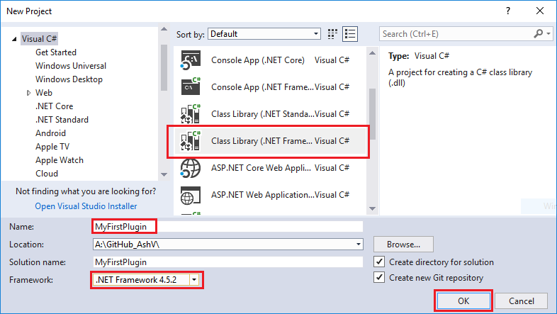
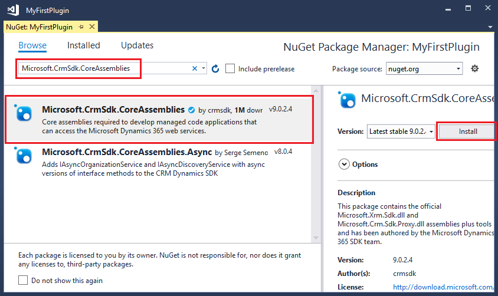
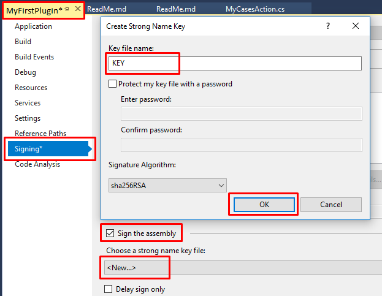
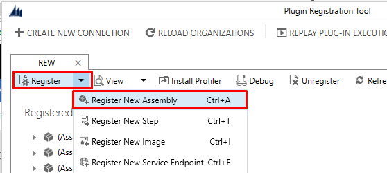
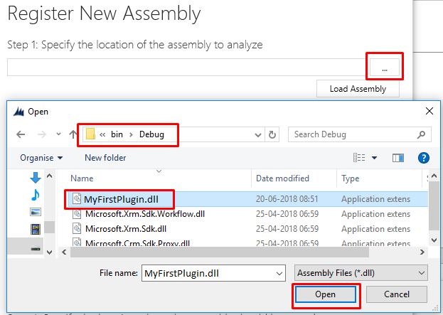
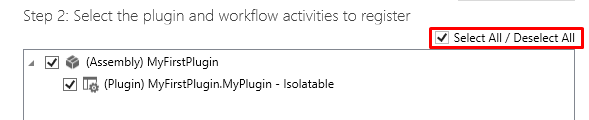
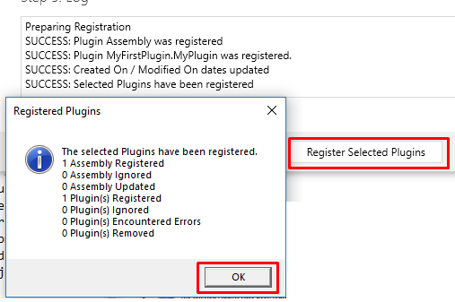
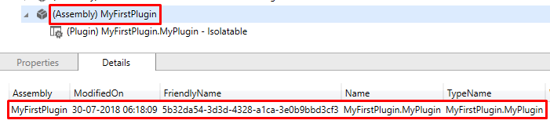

# Writing Plugins for Dynamics 365

In Dynamics 365 we can inject custom code to be executed on server side on occurrence of some event. We call this code **Plugin** and the events are called **Messages**. Here we will see how to create plugins for Dynamics 365.

### Step 1: Create Project



### Step 2: Add Dependencies

**Microsoft.CrmSdk.CoreAssemblies**



### Step 3: Implement IPlugin in Class

```csharp
using System;
using Microsoft.Xrm.Sdk;

namespace MyFirstPlugin
{
    class MyPlugin : IPlugin
    {
        public void Execute(IServiceProvider serviceProvider)
        {

        }
    }
}
```

### Step 4: Some necessary boilerplate code

```csharp
using System;
using Microsoft.Xrm.Sdk;

namespace MyFirstPlugin
{
    public class MyPlugin : IPlugin
    {
        public void Execute(IServiceProvider serviceProvider)
        {
            if (serviceProvider == null) return;

            // Obtain the Plugin Execution Context
            var context = (IPluginExecutionContext)serviceProvider.GetService(typeof(IPluginExecutionContext));

            // Obtain the organization service reference.
            var serviceFactory = (IOrganizationServiceFactory)serviceProvider.GetService(typeof(IOrganizationServiceFactory));
            var service = serviceFactory.CreateOrganizationService(context.UserId);

            // To check depth, this check can be changed in different scenarios
            if (context.Depth > 2) return;

            // The InputParameters collection contains all the data passed in the message request.
            if (context.InputParameters.Contains("Target") && context.InputParameters["Target"] is EntityReference)
            {
                // Your business logic goes here
            }
        }
    }
}
```

### Step 5: Add Business Logic

```csharp
// Your business logic goes here
var contact = (EntityReference)context.InputParameters["Target"];
service.Update(new Entity("contact", contact.Id) {
    Attributes =
    {
        { "jobtitle", "Updated on:" + DateTime.Now.ToString() }
    }
});
```

### Step 6: Signing the Assembly

In Dynamics 365 it is necessary to sign the assembly before registering. To do this
1. Right click on project, click on properties to open.
2. On left pane, click on Signing.
3. Check Sign the assembly checkbox.
4. In Choose a strong name key file dropdown click New...
5. Crete Strong Name Key popup will appear.
6. Give some name.
7. Optionally you can protect this key file with password.
8. Click Ok to generate key and sign the assembly.
9. Build the solution



### Step 7: Register the Assembly in Dynamics 365

Open the Plugin Registration Tool and connect with your organization. If you don't already have, grab it by adding **Microsoft.CrmSdk.XrmTooling.PluginRegistrationTool** nuget package.

**1.** Click on Register then Register New Assembly.



**2.** Register New Assembly popup will appear, select your project DLL from bin/debug folder of project.



**3.** After selecting DLL, make sure Select All is selected in Step 2.



**4.** Leave rest of he options as it is and click **Register Selected Plugins**, it should register your assembly successfully.



**5.** You can verify the assembly after registering in Plugin Registration Tool.




### Step 8:  Register Step for Plugin