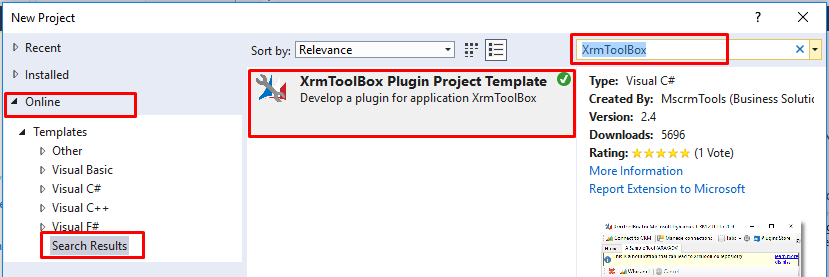
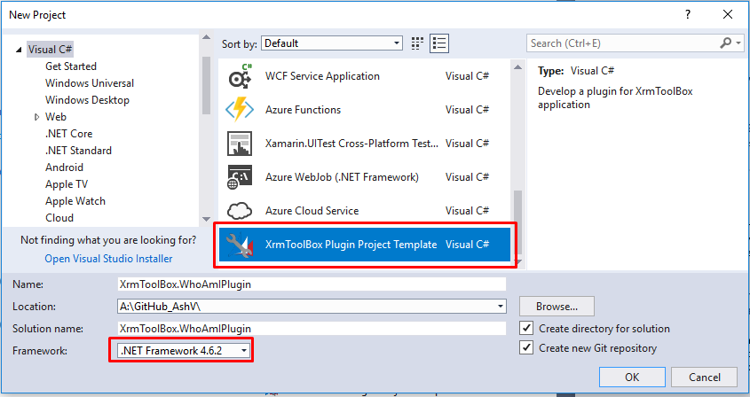

# How To Create Your Own XrmToolBox Plugins 

[XrmToolBox](https://www.xrmtoolbox.com) has plenty of useful plugins, and awesome people like you from community keep adding new plugins to solve Dynamics 365 developer's day to day hurdles and make them more productive.

Recently I was working on a XrmToolBox plugin (have a look on GitHub [Dynamics 365 Bulk Solution Exporter](https://github.com/AshV/Dynamics365BulkSolutionExporter/)). I thought of sharing my learning experience. I would like to thanks [Santish Bhagat](https://github.com/santoshCRM) who has already devloped many solutions for the Dynamics Community, has helped me in connection related issues, and [Shabbir Hussain](https://www.facebook.com/shabbir.WinSoft) who is young and energetic coder, has helped me in Windows Forms related stuff.

XrmToolBox is basically a class library, you can create your plugin in 2 ways.

1. Start by taking a class library project and installing [XrmToolBoxPackage](https://www.nuget.org/packages/XrmToolBoxPackage/) using nuget. You need to create one Custom Windows Form Control in this approach. I created [Dynamics 365 Bulk Solution Exporter](https://github.com/AshV/Dynamics365BulkSolutionExporter/) in this way, because tempalte was not available back then.

2. Tanguy Touzard (Creator of XrmToolBox) has simplifed the process by creating **XrmToolBox Plugin Project Template for Visual Studio**, which configures most of the things automatically. This is preferred way of creating plugins now.

### Start Project with XrmToolBox Plugin Project Template

You won't be getting this project template by default in Visual Studio, to install goto new project dialog, navigate to `online` section in left pane and search for `XrmToolBox` in right pane, template will appear in result. install it, Visual Studio need to be restarted in order to install the template.



After installing, create new Project using this template. Framework version should be selected as 4.6.2.



### Components of Project

You will get 2 main files in newly created project where you need to work on.

#### 1. MyPlugin.cs

This file conatains metadata like name of the plugin, icons and color etc, which you can change according to purpose of your plugin. I am leaving this as it is for now.

```csharp
using System.ComponentModel.Composition;
using XrmToolBox.Extensibility;
using XrmToolBox.Extensibility.Interfaces;

namespace XrmToolBox.WhoAmIPlugin
{
    // Do not forget to update version number and author (company attribute) in AssemblyInfo.cs class
    // To generate Base64 string for Images below, you can use https://www.base64-image.de/
    [Export(typeof(IXrmToolBoxPlugin)),
        ExportMetadata("Name", "My First Plugin"),
        ExportMetadata("Description", "This is a description for my first plugin"),
        // Please specify the base64 content of a 32x32 pixels image
        ExportMetadata("SmallImageBase64", null),
        // Please specify the base64 content of a 80x80 pixels image
        ExportMetadata("BigImageBase64", null),
        ExportMetadata("BackgroundColor", "Lavender"),
        ExportMetadata("PrimaryFontColor", "Black"),
        ExportMetadata("SecondaryFontColor", "Gray")]
    public class MyPlugin : PluginBase
    {
        public override IXrmToolBoxPluginControl GetControl()
        {
            return new MyPluginControl();
        }
    }
}
```

#### 2. MyPluginControl.cs