# Creating Custom Workflow Activity in Dynamics 365


In Dynamics 365 Workflows if some functionality is not available in out of the box features, we have option to write Custom Workflow Activity and consume that in workflow processes. Let's see how to create Custom Workflow Activities for Dynamics 365. Here for example we will write an activity which will take text as input and return work count as output.

### Step 1: Create New Project

In Visual Studio create new project of type Class Library & select framework version 4.5.2, this might change for future versions. Name I have given as **WordCountWorkflow**, which tells the purpose of the workflow.

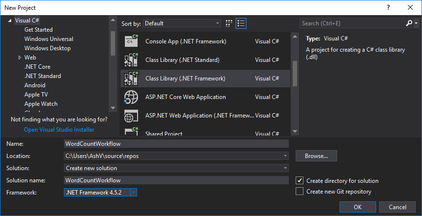

### Step 2: Add Required Packags

Goto manage nugget packages and install **Microssoft.CrmSdk.CoreAssemblies**(for Microsoft.Xrm.Sdk namespace) & **Microssoft.CrmSdk.Workflow**(for Microsoft.Xrm.Sdk.Workflow namespace).


### Step 3: Create WordCount Class

Create class **WordCount** and inherited from **CodeActivity**, it would require to add **System.Activities** namespace.

```csharp
using System.Activities;

namespace WordCountWorkflow
{
    public class WordCount : CodeActivity
    {
        protected override void Execute(CodeActivityContext context)
        {

        }
    }
}
```

### Step 4: Add Input/Output Parameters

Our workflow activity will require one input parameter of type text and one output parameter of type number to return word count. Let's add them to the class, it would require **Microsoft.Xrm.Sdk.Workflow** to be added.

```csharp
using Microsoft.Xrm.Sdk.Workflow;
using System.Activities;

namespace WordCountWorkflow
{
    public class WordCount : CodeActivity
    {
        [RequiredArgument]
        [Input("Input Text")]
        public InArgument<string> InputText { get; set; }

        [Output("Word Count")]
        public OutArgument<int> CountOfWords { get; set; }

        protected override void Execute(CodeActivityContext context)
        {

        }
    }
}
```

### Step 5: Add Word Count Logic & Get/Set Parameters 

Inside **Execute** method we are getting **InputText** parameter value and applying **Split()** to split into words then **.Length** property to get the count of words. Finally setting this value to **CountOfWords** parameter.

```csharp
using Microsoft.Xrm.Sdk.Workflow;
using System;
using System.Activities;

namespace WordCountWorkflow
{
    public class WordCount : CodeActivity
    {
        [RequiredArgument]
        [Input("Input Text")]
        public InArgument<string> InputText { get; set; }

        [Output("Word Count")]
        public OutArgument<int> CountOfWords { get; set; }

        protected override void Execute(CodeActivityContext context)
        {
            this.CountOfWords.Set(
                context,
                this.InputText.Get<string>(context).Split(
                    new char[] { ' ', '\r', '\n' },
                    StringSplitOptions.RemoveEmptyEntries).Length);
        }
    }
}
```

### Step 6: Signing the Assembly

In Dynamics 365 it is necessary to sign the assembly before registering. To do this
1. Right click on project, click on properties to open.
2. On left pane, click on Signing.
3. Check Sign the assembly checkbox.
4. In Choose a strong name key file dropdown click New...
5. Crete Strong Name Key popup will appear.
6. Give some name.
7. Optionally you can protect this key file with password.
8. Click Ok to generate key and sign the assembly.
9. Build the solution

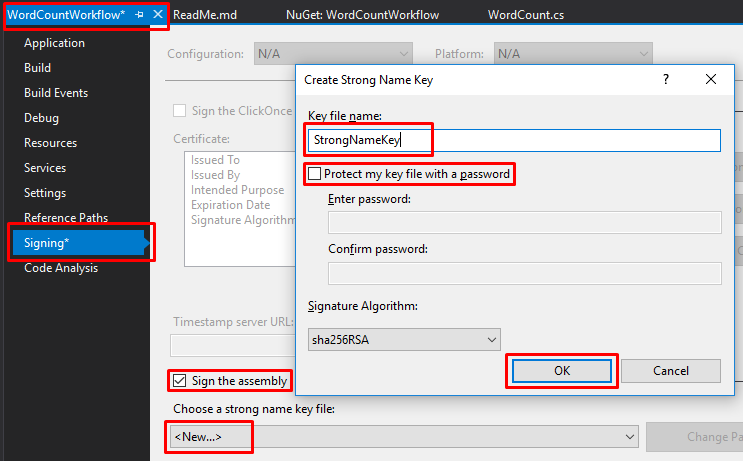

### Step 7: Register the Assembly in Dynamics 365

Open the Plugin Registration Tool and connect with your organization. If you don't already have, grab it by adding **Microsoft.CrmSdk.XrmTooling.PluginRegistrationTool** nuget package.

**1.** Click on Register then Register New Assembly.


**2.** Register New Assembly popup will appear, select your project DLL from bin/debug folder of project.

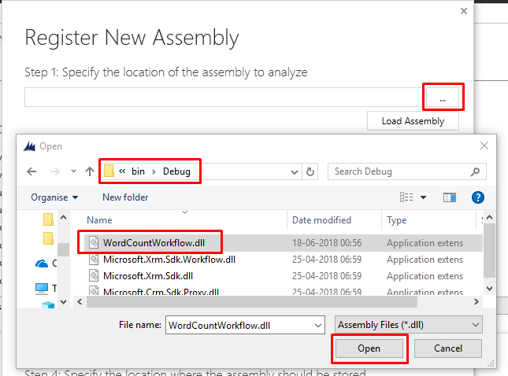

**3.** After selecting DLL, make sure Select All is selected in Step 2.

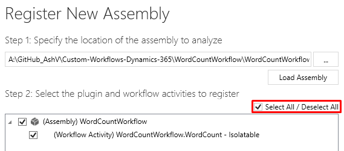

**4.** Leave rest of he options as it is and click **Register Selected Plugins**, it should register your assembly successfully.

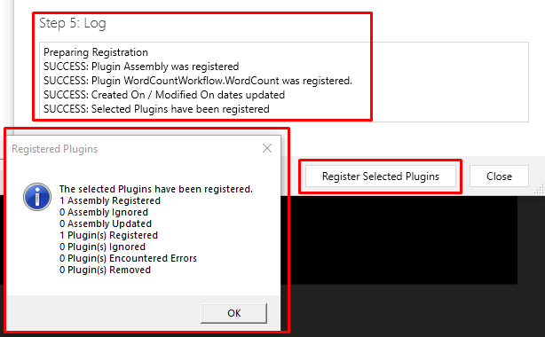

**5.** You can verify the assembly after registering in Plugin Registration Tool.

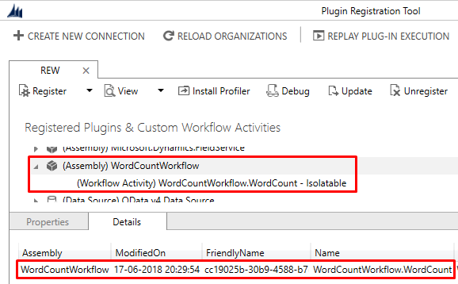

### Step 8: Consuming Custom Workflow Activity in Workflow Process

**1.** Open CRM, goto solution where you want to create Workflow, navigate to Processes & create new. Give some meaningful name, I've given "Word Counter", select Category as "Workflow" & select "Contact" in Entity. I have created as realtime workflow by unchecking "Run this workflow in the background (recommended)" checkbox, for the ease of testing.

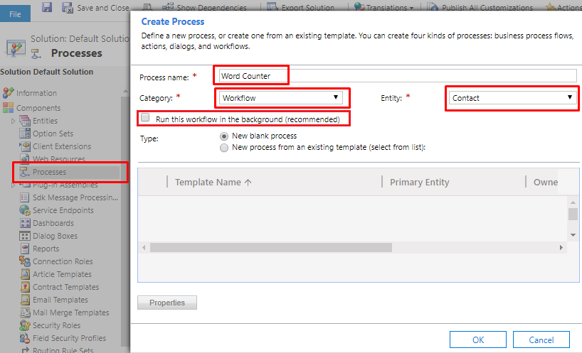

**2.** After Creation check "As an on-demand process" to make as On-demand workflow.

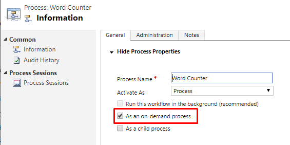

**3.** Click on "Add Step" and look for our assembly name i.e **WordCountWorkflow**, click on this **WordCountWorkflow.WordCount** will appear, click on this to add step.

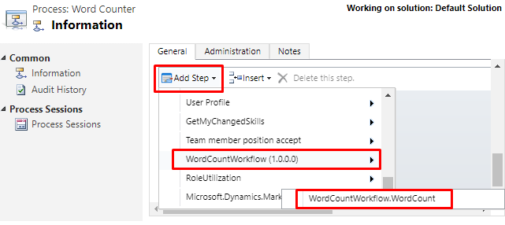

**4.** In added step click "Set Properties", In properties set **Input Text**(Input parameter given in code) as Address field of Contact record.


**5.** Add another update step, and set **Job Title** field as **Word Count**(Output Parameter given in code).

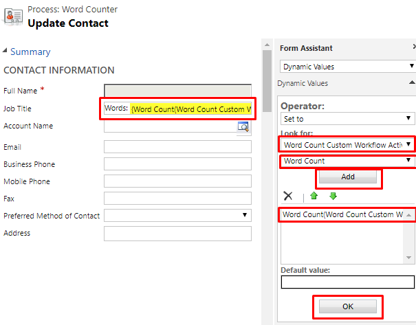

**6.** Workflow is completed, Save it & Activate it.

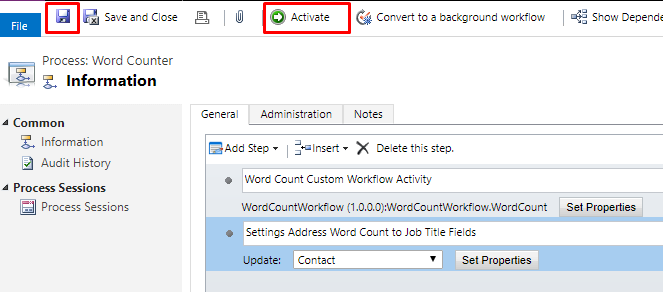

### Testing the Workflow

**1.** To test this, I have created one contact record with **Address** field populated which has 9 words in total. Expand top menu in form and click "Run Workflow". 

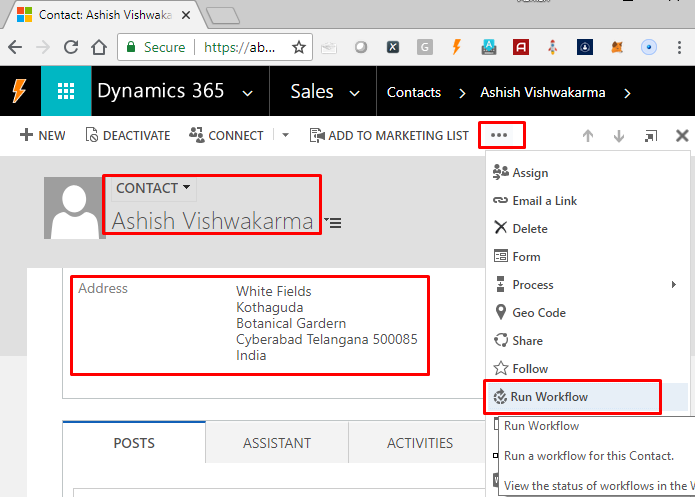

**2.** In appearing popup, select our "Word Counter" workflow and click "Add".

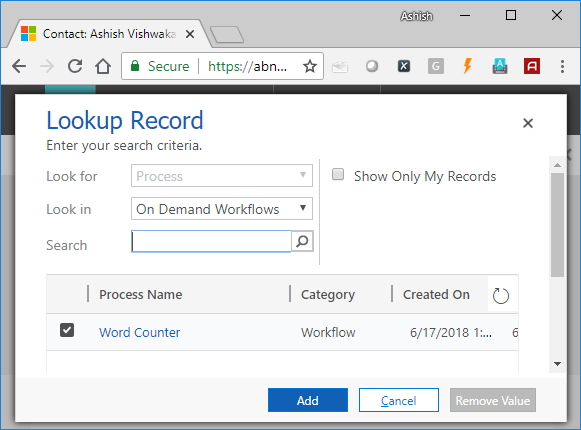

**3.** It will ask for confirmation to run, click "OK".

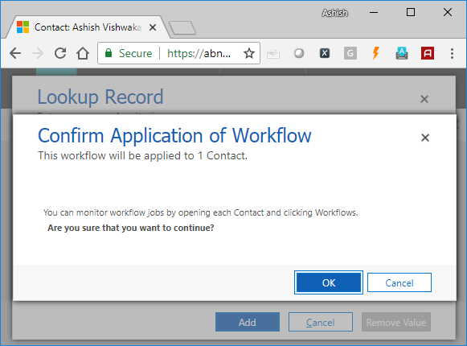

**4.** Let the execution complete.

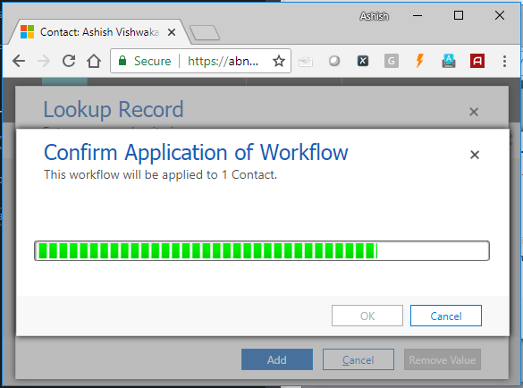

**5.** Refresh the form to update and verify whether **Job Title** field is updated with the Word Count of Address field. 


Congrats! Your Custom Workflow Activity is running successfully.

> Thanks for reading!