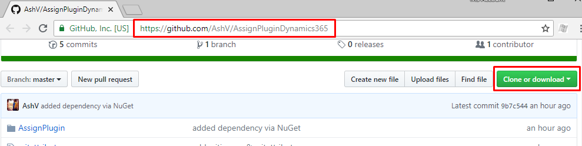
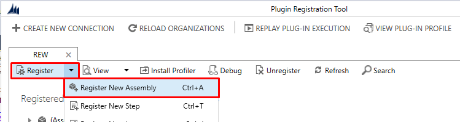
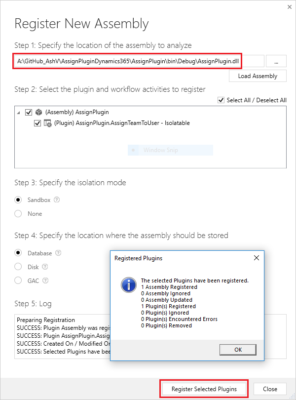
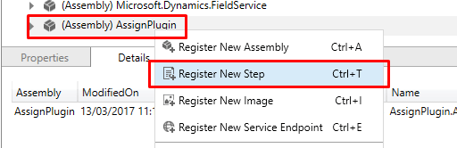
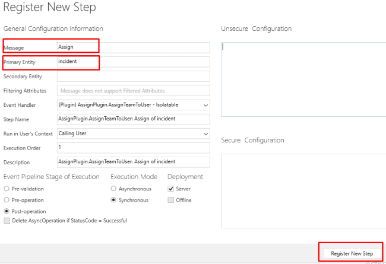

# Debugging Plugins in Dynamics 365 with Plugin Registration Tool

To debug plugin code in Dynamics 365, We use profiling in Plugin Registration Tool. Here for sample plugin I'm using code from one of the [previous article](https://www.c-sharpcorner.com/article/assigning-case-to-appropriate-team-user-using-plugin-in-dynamics-365-crm/) you can use this or try with your own plugins. If you don't already have Plugin Registration Tool grab it from NuGet(https://www.nuget.org/packages/Microsoft.CrmSdk.XrmTooling.PluginRegistrationTool/).

## Step 1: Register Plugin in Dynamics 365

If you already have some plugin in your environment to debug, you can skip this step. Download and build the plugin code from [https://github.com/AshV/AssignPluginDynamics365](https://github.com/AshV/AssignPluginDynamics365).

Open Plugin Registration Tool, connect to your organization & click on "Register New Assembly"

Browse for your assembly & click "Register Selected Plugins" to register it.

## Step 2: Registering Step

