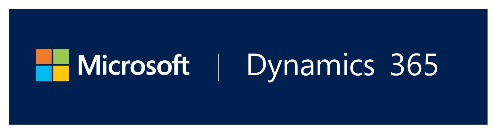
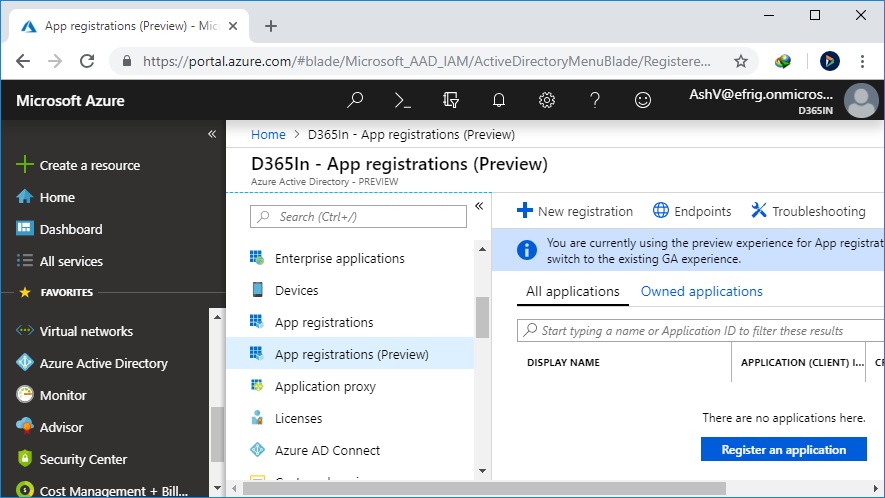
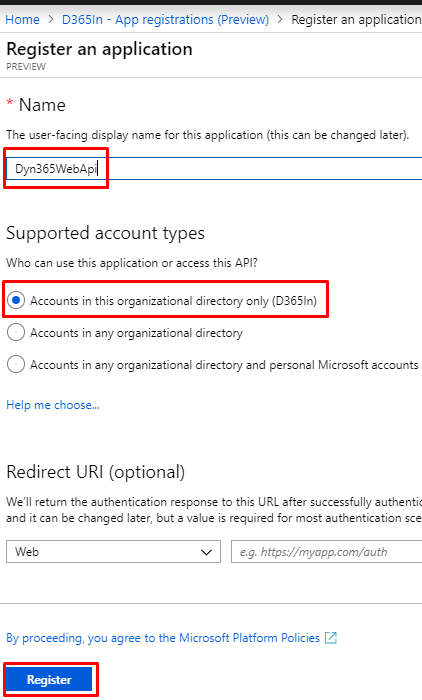
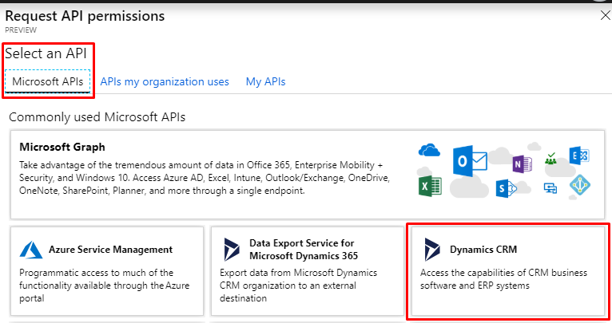
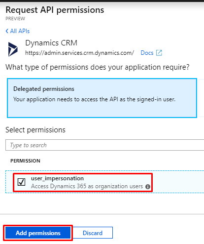
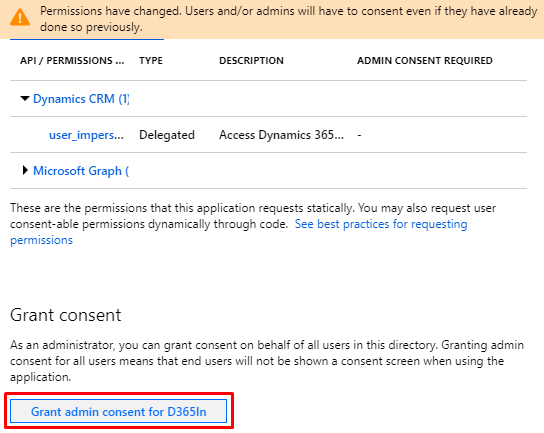
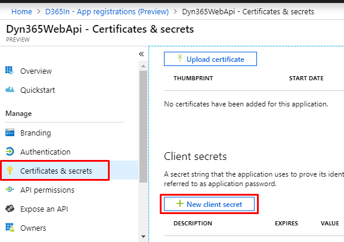
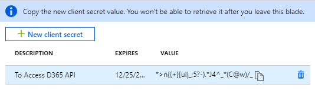
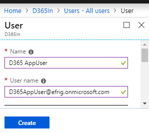
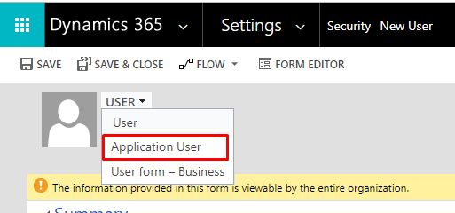

# Generate Access Token for Dynamics 365 Single Tenant Server to Server Authentication

In Dynamics 365 integration scenarios most of the times we need to authenticate only single tenant. Since now Dynamics 365 authentication only through Azure AD (for online instances) is recommended let's see how to do it. To achieve this first of all we need to create App in Azure Active Directory and good news is that you don't need Azure subscription to try this out, your Dynamics 365 free trial is enough.

These 4 steps are involved to implement this, you can always jump to next step if know current step. This topic may not be very new to everyone, but when I got to implement the same recently it took me few hours to make it work, because of recent of frequent Azure updates or outdated content maybe. which leads me to write this.

1. Create & configureApp in Azure Active Directory
2. Create User in Azure AD and Configure it as Application User in Dynamics 365
3. Write C# code with ADAL(Active Directory Authentication Library) to generate Access Token
4. Making requests to Dynamics 365 with above generated Access Token

## Step 1: Create Azure AD App

* Navigate to Azure(https://portal.azure.com).
* On left menu click on **Azure Active Directory** -> App registrations(Preview) => **+ New registration**, We will use Preview version only because it has more straight forward options and going forward this only is going to be default option.

* Give some Name to your App, and for account type select *Accounts in this organizational directory only* because we need it for single tenant only.

* Once App is created, click on API permissions to add new permission for your app.

* Select Dynamics CRM here.

* Check user_impersonation box in upcoming screen and click *Add permissions*

* These permission require admin consent, click on **Grant admin consent for your-org** button and confirm it. You need administrator role to do it.
* 

**Now your App is created, we need three things to use further from here.**

1. Application Id aka Client Id
2. Tenant Id
3. Client Secret

* Application Id & Tenant Id you can grab from App Overview.

* To generate Client Secret go to **Certificates & secrets** and then **+ New client secret**, Give some description and select validity of your secret, click **Add**.

* Client Secret is something which you should keep secret, that why you can see this only once after generation, copy it and keep it safe to use later.
* 

## Step 2: Create Application User

* You need to create a new user, all CRM Api calls will be made on behalf of this user.
* This user does not require Dynamics 365 license.
* This user should be created from Azure(https://portal.azure.com), not from Office Portal(https://admin.microsoft.com)
* Navigate to Azure -> Azure Active Directory -> Users, Click on **+ New user**.

* Here Username field must be has same domain name as your org. Copy it you will need it further.
* Once this user is create, Go to your Dynamics 365 instance.
* Navigate to Dynamics 365 -> Settings -> Security, Click on Users here.
* Change view to Application Users & click on **+ NEW** to create new Application User.

* You may need to set from also as Application User if it's not coming by default.

## Step 3: Get Access Token with ADAL

## Step 4: Consuming Access Token