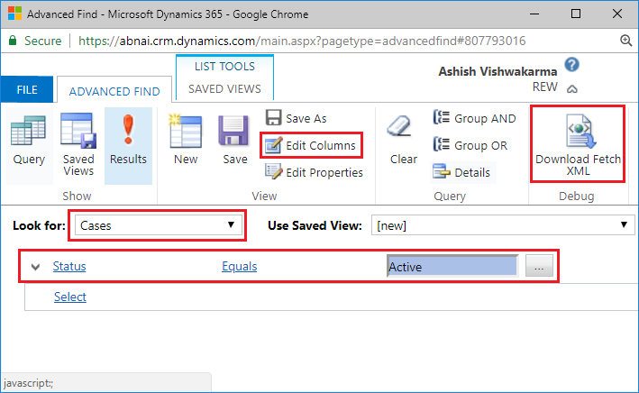

# Execute fetchXML with WebAPI in Dynamics 365 using JavaScript

In Dynamics 365 WebAPI we can retrieve data using OData queries, but if there is some complex requirement it's better to query using fetchXML, and good news is Dynamics 365 WebAPI supports querying using fetchXML. With fetchXML we have 2 main advantage, it can be easily generated using Advanced Find & It's more readable. You can even use Joins & Aggregate function in fetchXML queries which are not possible using Advanced Find(refer http://msxrmtools.com/fetchxml/reference). Let's see how can we query fetchXML with WebAPI.

## Generate fetchXML using Advanced Find

Click on funnel icon to open Advanced Find window.


I have created a simple fetchXML query to retrieve all the active cases with few columns.



Click on "Download Fetch XML" button to get the below fetchXML query.

```xml
<fetch version="1.0" output-format="xml-platform" mapping="logical" distinct="false">
  <entity name="incident">
    <attribute name="title" />
    <attribute name="ticketnumber" />
    <attribute name="createdon" />
    <attribute name="incidentid" />
    <attribute name="caseorigincode" />
    <order attribute="title" descending="false" />
    <filter type="and">
      <condition attribute="statecode" operator="eq" value="0" />
    </filter>
  </entity>
</fetch>
```

## Executing fetchXML with GET method

To execute fetchXML you need to append entity's plural name in WebAPI endpoint and pass fetchXml in query string, and make http/ajax request

> #### Syntax: WebAPI Endpoint + / + Entity Plural Name + ?fetchXml= + Your fetchXml here

**Example:**
 
 ```xml
 https://AshV.crm.dynamics.com/api/data/v9.0/incidents?fetchXml=<fetch version="1.0" output-format="xml-platform" mapping="logical" distinct="false"><entity name="incident"><attribute name="title" /><attribute name="ticketnumber" />    <attribute name="createdon" /><attribute name="incidentid" /><attribute name="caseorigincode" /><order attribute="title" descending="false" /><filter type="and"><condition attribute="statecode" operator="eq" value="0" /></filter></entity></fetch>
```

```js
var fetchXmlQuery = `
<fetch version="1.0" output-format="xml-platform" mapping="logical" distinct="false">
  <entity name="incident">
    <attribute name="title" />
    <attribute name="ticketnumber" />
    <attribute name="createdon" />
    <attribute name="incidentid" />
    <attribute name="caseorigincode" />
    <order attribute="title" descending="false" />
    <filter type="and">
      <condition attribute="statecode" operator="eq" value="0" />
    </filter>
  </entity>
</fetch>`;

var req = new XMLHttpRequest();
req.open(
  "GET",
  Xrm.Page.context.getClientUrl() +
    "/api/data/v9.0/incidents?fetchXml=" +
    encodeURIComponent(fetchXmlQuery),
  true
);
req.setRequestHeader("OData-MaxVersion", "4.0");
req.setRequestHeader("OData-Version", "4.0");
req.setRequestHeader("Accept", "application/json");
req.setRequestHeader("Content-Type", "application/json; charset=utf-8");
req.setRequestHeader("Prefer", 'odata.include-annotations="*"');
req.onreadystatechange = function() {
  if (this.readyState === 4) {
    req.onreadystatechange = null;
    if (this.status === 200) {
      var results = JSON.parse(this.response);
      console.dir(results);
    } else {
      Xrm.Utility.alertDialog(this.statusText);
    }
  }
};
req.send();

```


```json
{  
   "@odata.context":"https://abnai.crm.dynamics.com/api/data/v9.0/$metadata#incidents(title,ticketnumber,createdon,incidentid,caseorigincode)",
   "value":[  
      {  
         "@odata.etag":"W/\"1095635\"",
         "title":"Average order shipment time",
         "ticketnumber":"CAS-01213-P8B3X0",
         "createdon":"2017-01-20T22:50:45Z",
         "incidentid":"b69e62a8-90df-e311-9565-a45d36fc5fe8",
         "caseorigincode":3
      },
      {  
         "@odata.etag":"W/\"1092817\"",
         "title":"Shipping time information resend",
         "ticketnumber":"CAS-01261-N0C8H9",
         "createdon":"2017-01-20T22:51:13Z",
         "incidentid":"169f62a8-90df-e311-9565-a45d36fc5fe8",
         "caseorigincode":2
      }
   ]
}
```