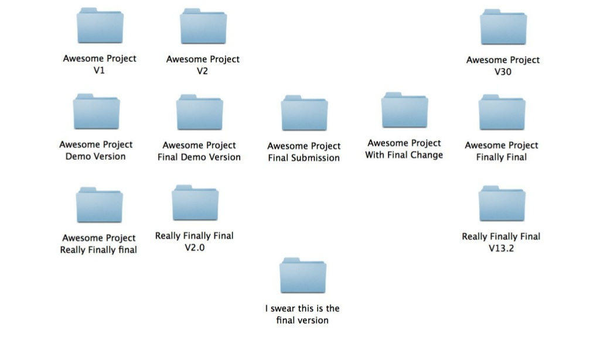
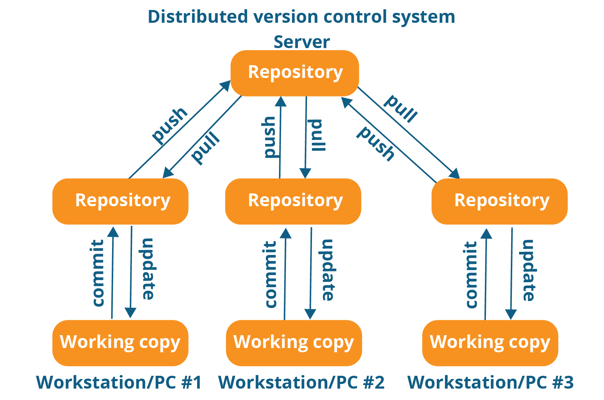

# Git with Command Line For Absolute Beginners

Git is a distributed version control system, developed by [Linus Torvalds](https://en.wikipedia.org/wiki/Linus_Torvalds) in 2005. There are many popular GUI tools and extensions are available to use git, but originally git was developed as command line tool, it is still fun to use git using command line, you will also understand under the hood magic done by GUI tools.

### Why Version Control ?

Version Control Systems are used for Time Travel by ~~Astronaults~~ Developers.

If you ever had your project copies likes above image, definitely you need a Version Control System.

### Distributed Version Control System

