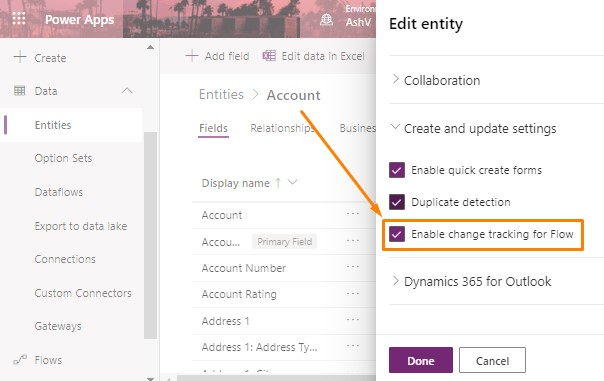
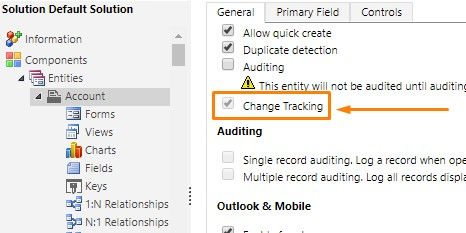

# Incremental Data Migration with Change Tracking in Common Data Service/Dynamics 365

If you are still using something like `'modifiedOn'>'lastSyncDate'` in your data migration scenarios you are quite 5 years outdated, beacuse **Change Tracking** feature was already introduced in Dynamics CRM v2015. Change Tracking is being utilized by different tools and functilities to name a few are KingswaySoft, PowerAutomate & Marketing Email's Assist Edit etc. Never mind, let's explore this not very new but useful feature.

 Change Tracking is a strategy which helps to retrieve only updated/changed data since last time synchronizaion, apart from Common Data Services, this type of strategies are being used in SQL server and Entity framework also.

## Enabling Change Tracking

By default Change Tracking is enable for all OOB entities, you may enable this for you custom entity by clicking on `settings` top menu then more option, under `create and update settings` you will find checkbox 'Enable chnage tracking for Flow' as shown in image below.

Finding this checkbox is pretty simple in classic interface(refer image).

## How to use

If using C# XRM SDK [RetrieveEntityChangesRequest](https://docs.microsoft.com/en-us/dotnet/api/microsoft.xrm.sdk.messages.retrieveentitychangesrequest?view=dynamics-general-ce-9) helps to use Change Tracking feature.
If using Web API then HTTP header `Prefer: odata.track-changes` should be used.

Let's understand each of them with some code example.
