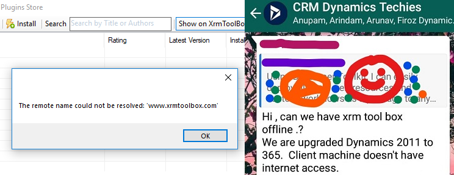
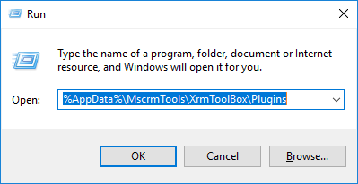
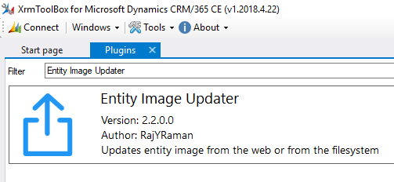
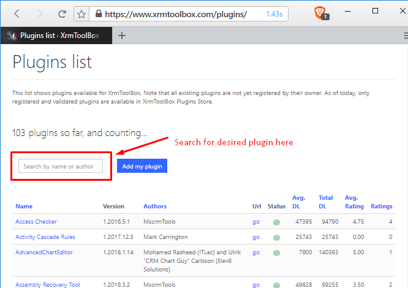
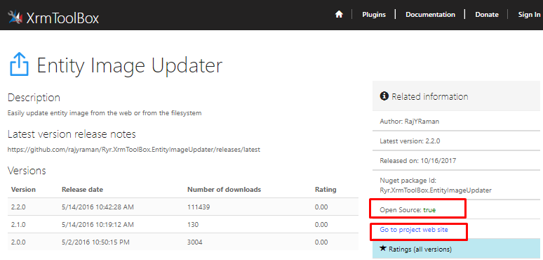
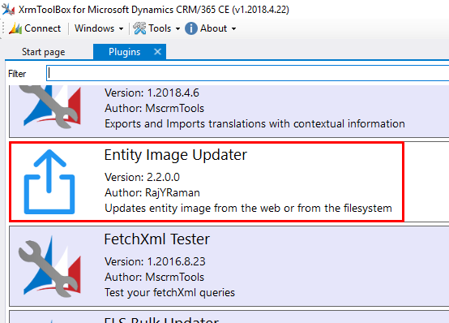

# Installing XrmToolBox Plugins in No Internet OnPremises Environments

**TL;DR :** Place the XrmToolBox plugin DLL in **%AppData%\MscrmTools\XrmToolBox\Plugins** folder and get going.

___

[XrmToolBox](https://www.xrmtoolbox.com/) is undoubtedly the best productivity tool for D365 developer. Few days back, one person in forum was trying to use third party XrmToolBox plugin in On-Premises environment where internet was not available for some reason. Let's see how to handle this situation.

To use any XrmToolBox plugin without internet we have to grab the DLL of the plugin, which you can get in two ways.

### 1. Get the DLL from already installed XrmToolBox

Navigate to **%AppData%\MscrmTools\XrmToolBox\Plugins** in machine where you have already installed desired XrmToolBox plugin and find for the DLL.

For example I have this plugin installed and I want this in my no internet environment.

Look for the DLL with this/similar name, may conatain author name etc. For this one DLL is **Ryr.XrmToolBox.EntityImageUpdater.dll**.

### 2. Build the DLL from source code if open source

You can navigate to [XrmToolBox.com/plugins/](https://www.xrmtoolbox.com/plugins/) and search for desired plugin.

Once you found it. check whetehr it's open source. navigate to source code location, grab it build it. Like this awesome plugin is developed by [Natraj Yegnaraman](https://github.com/rajyraman) and source code is hosted at [GitHub/rajyraman/Ryr.XrmToolBox.EntityImageUpdater](https://github.com/rajyraman/Ryr.XrmToolBox.EntityImageUpdater)

After building code grab the DLL from *bin/debug* or *bin/release(preferred, build with release config)*.

## Place DLL \& use plugin in No Internet enviromnet 

Now move the above grabbed DLL to destination environment somehow network share or pendrive. and place the DLL to same folder i.e  **%AppData%\MscrmTools\XrmToolBox\Plugins**. And here you go. Open XrmToolBox and you will see this plugin in plugin list, you can use like any other plugin.

### Things to consider

* Some plugins use internet to achieve functionality. those can't be used.
* Bigger plugins may contains more data/folder other than DLL, so all data should be moved propertly.
* Folder location may change(rare chances) which should be taken care.