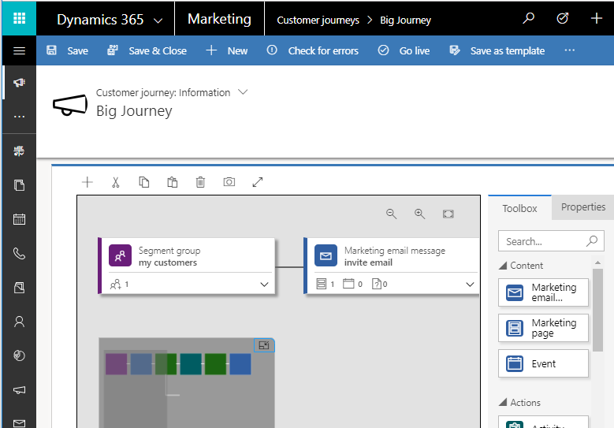

# Parsing Customer Journey Workflow Definition JSON with Linq.js in Dynamics 365 for Marketing

In Dynamics 365 Apps many configurations and data are being saved as JSON rather than creating relationships between entities or saving as XML. Customer Journey is one of those entity, this provides visual designer like shown below to design workflow and this is saved as JSON behind the scenes in **msdyncrm_workflowdefinition** column.

Sometimes we need to programatically query than which all records are participating in customer journey workflow. T