# Creating Custom Actions for Dynamics 365 with C\#

Custom Actions are lesser used processes than Workflows and Plugins in Dynamics 365, but very useful also at the same time. People who have already have idea about Custom Workflow Activity or [read my previous article](https://www.c-sharpcorner.com/article/creating-word-counter-custom-workflow-activity-in-dynamics-365/) it's going to be very easy, coding part is same, only how we consume the code in dynamics 365 process is different, and use cases too, obviously. Custom Actions can be created with or without writing code, but they can be triggered only by the code. Here we will write custom code to retrieve case records assigned to calling user.

### Step 1: Create New Project

In Visual Studio create new project of type Class Library & select framework version 4.5.2, this might change for future versions. Name I have given as **MyCasesAction**, which tells the purpose of the workflow.

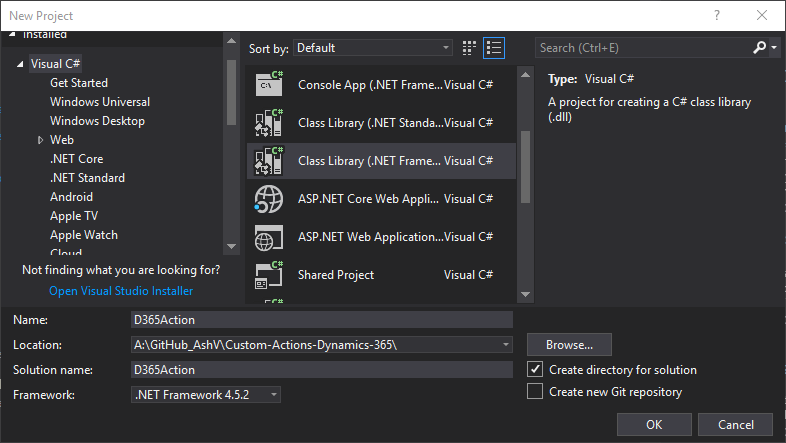

### Step 2: Add Required Packags

Goto manage nugget packages and install **Microssoft.CrmSdk.CoreAssemblies**(for Microsoft.Xrm.Sdk namespace) & **Microssoft.CrmSdk.Workflow**(for Microsoft.Xrm.Sdk.Workflow namespace).

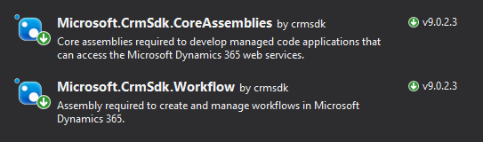

### Step 3: Create MyCasesAction Class

Create class **MyCasesAction** and inherited from **CodeActivity**, it would require to add **System.Activities** namespace.

```csharp
using System.Activities;

namespace MyCasesAction
{
    public class MyCasesAction : CodeActivity
    {
        protected override void Execute(CodeActivityContext context)
        {

        }
    }
}
```

### Step 4: Adding Parameters

We will have 2 output parameters one containing count of cases, other having name of cases separated by comma. User's GUID we will take from context.

```csharp
using Microsoft.Xrm.Sdk.Workflow;
using System.Activities;

namespace MyCasesAction
{
    public class MyCasesAction : CodeActivity
    {
        [Output("Count of Cases")]
        public OutArgument<int> CaseCount { get; set; }

        [Output("Name of Cases")]
        public OutArgument<string> CaseNames { get; set; }

        protected override void Execute(CodeActivityContext context)
        {

        }
    }
}
```

### Step 5: Adding Logic to Retrieve User Cases

```csharp
using Microsoft.Xrm.Sdk;
using Microsoft.Xrm.Sdk.Query;
using Microsoft.Xrm.Sdk.Workflow;
using System.Activities;
using System.Collections.Generic;

namespace MyCasesAction
{
    public class MyCasesAction : CodeActivity
    {
        [Output("Count of Cases")]
        public OutArgument<int> CaseCount { get; set; }

        [Output("Name of Cases")]
        public OutArgument<string> CaseNames { get; set; }

        protected override void Execute(CodeActivityContext context)
        {
            // Getting OrganizationService from Context
            var workflowContext = context.GetExtension<IWorkflowContext>();
            var serviceFactory = context.GetExtension<IOrganizationServiceFactory>();
            var orgService = serviceFactory.CreateOrganizationService(workflowContext.UserId);

            // fetchXml to retrieve cases for current user
            var fetchXmlCurrentUserCases = @"
            <fetch version='1.0' output-format='xml-platform' mapping='logical' distinct='false'>
              <entity name='incident'>
                <attribute name='title' />
                <filter type='and'>
                  <condition attribute='ownerid' operator='eq-userid' />
                </filter>
              </entity>
            </fetch>";

            // Retrieving cases using fetchXml
            var cases = orgService.RetrieveMultiple(
                new FetchExpression(
                    fetchXmlCurrentUserCases));

            // Null check
            if (cases == null || cases?.Entities == null) return;

            // Adding Case names/titles to list
            var allCases = new List<string>();
            foreach (var cs in cases.Entities)
                allCases.Add(cs["title"].ToString());

            // Set Count of cases to CaseCount
            CaseCount.Set(context, cases.Entities.Count);

            // Set comma separated Case Titles to CaseNames
            CaseNames.Set(context, string.Join(",", allCases.ToArray()));
        }
    }
}
```

### Step 6: Signing the Assembly

In Dynamics 365 it is necessary to sign the assembly before registering. To do this
1. Right click on project, click on properties to open.
2. On left pane, click on Signing.
3. Check Sign the assembly checkbox.
4. In Choose a strong name key file dropdown click New...
5. Crete Strong Name Key popup will appear.
6. Give some name.
7. Optionally you can protect this key file with password.
8. Click Ok to generate key and sign the assembly.
9. Build the solution

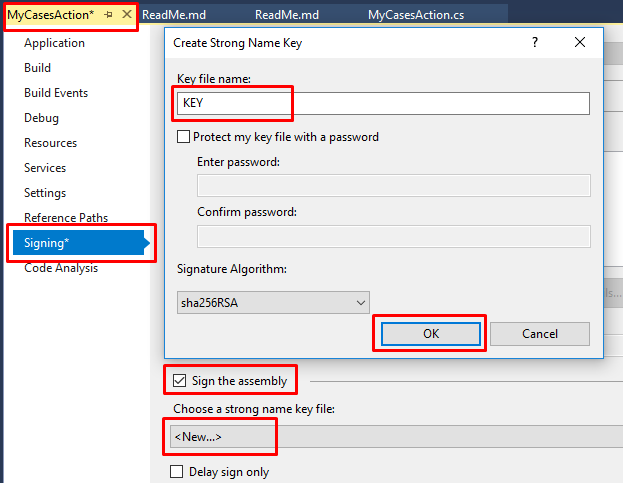

### Step 7: Register the Assembly in Dynamics 365

Open the Plugin Registration Tool and connect with your organization. If you don't already have, grab it by adding **Microsoft.CrmSdk.XrmTooling.PluginRegistrationTool** nuget package.

**1.** Click on Register then Register New Assembly.


**2.** Register New Assembly popup will appear, select your project DLL from bin/debug folder of project.


**3.** After selecting DLL, make sure Select All is selected in Step 2.

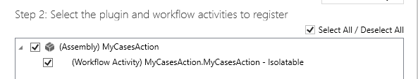

**4.** Leave rest of he options as it is and click **Register Selected Plugins**, it should register your assembly successfully.

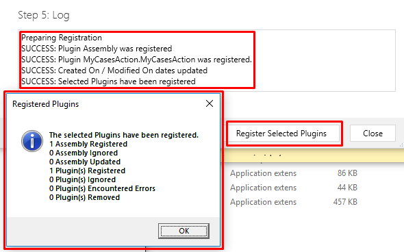

**5.** You can verify the assembly after registering in Plugin Registration Tool.

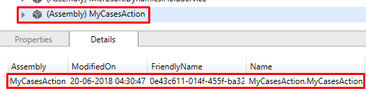

### Step 8: Creating Custom Action in CRM and Consuming MyCasesAction

**1.** Goto solution, create new process, set name as "Get My Cases", set category as "Action" & in entity I'm setting as "None (global)". If we will select some entity here, our action will get one default input parameter of type same as given entity.

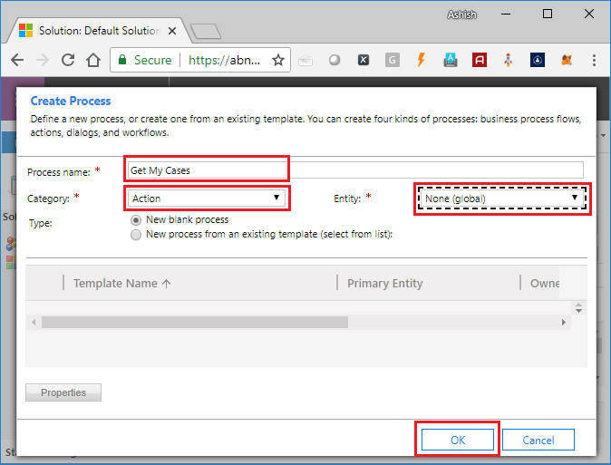

**2.** Add 2 output arguments with same type as output parameters given in MyCasesAction class. Name not need to be the same but you can give same to avoid confusion.

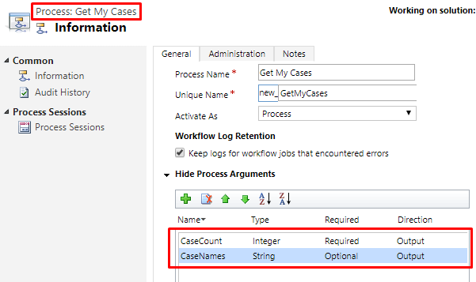

**3.** Click on Add Step & look for your assembly i.e MyCasesAction, click on it and select **MyCasesAction.MyCasesAction** step.

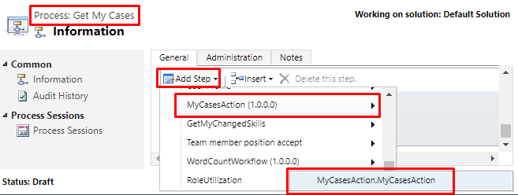

**4.** Step added from assembly will return case count and names, which should be set to output arguments, add "Assign Value" step for both arguments.

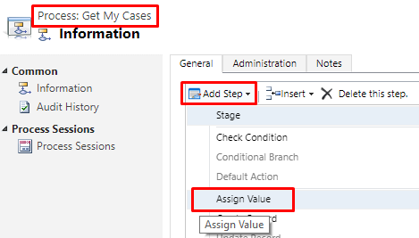

**5.** Click on "Set Properties" in Assign Value to set output argument value. Do it for both "CaseCount" & "CaseNames".

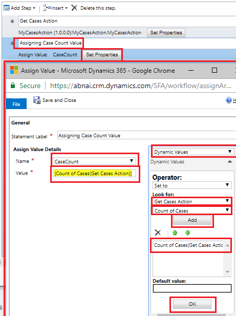

**6.** Save your process & Click on "Activate" to activate it.

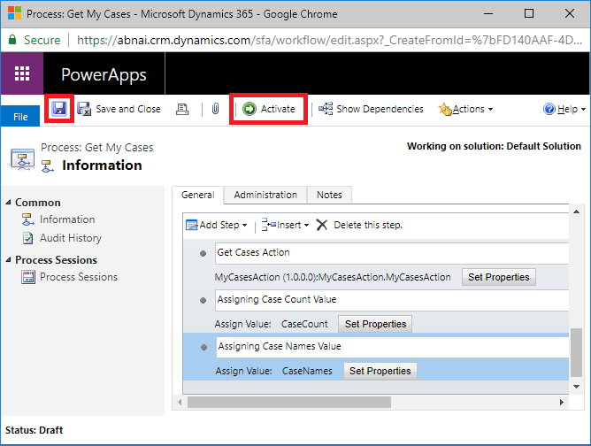

**7.** It will ask for confirmation, click "Activate" to confirm.

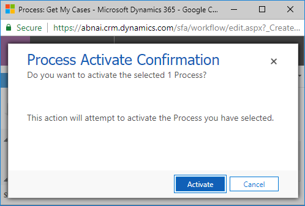

Congratulations! You have successfully created Custom Action. Let's test it now.

### Step 9: Testing Your Custom Action

As I mentioned above, Custom Actions can be triggered with code only. I will be using [Dynamics 365 Console Caller](https://www.ashishvishwakarma.com/Dynamics365ConsoleCaller/) to test our code, you can download this by following [https://github.com/AshV/Dynamics365ConsoleCaller](https://github.com/AshV/Dynamics365ConsoleCaller).

You need to grab Unique Name/Logical Name of your process. Which id **new_GetMyCases** in our case.

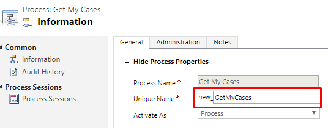

After downloading [Dynamics 365 Console Caller](https://www.ashishvishwakarma.com/Dynamics365ConsoleCaller/) open in visual studio and open Program.cs. Provide connection details & add code to test your custom action. 

```csharp
using Microsoft.Crm.Sdk.Messages;
using Microsoft.Xrm.Sdk;
using System;
using static System.Console;

namespace Dynamics365ConsoleCaller
{
    class Program // BUILD BEFORE RUN TO RESTORE NuGet PACKAGES
    {
        static void Main(string[] args)
        {
            IOrganizationService orgService = Connect.GetOrganizationService(
                 "Email@Org.onmicrosoft.com",
                 "Your-Passowrd",
                 "https://Org.crm.dynamics.com");
            Console.WriteLine("Connected to Organization Service!");

            ITracingService tracingService = Connect.GetTracingService("AshV_Log");

            // Write Your Testing Code here.

            var executeAction = orgService.Execute(
                new OrganizationRequest()
                {
                    RequestName = "new_GetMyCases",
                });

            var caseCount = executeAction["CaseCount"];
            var caseNames = executeAction["CaseNames"];

            WriteLine($"Count of Cases : {caseCount}");
            WriteLine($"Name Cases : {caseNames}");
        }
    }
}
```

Run the above code to test and verify your custom action. To learn more about calling custom action with C# & JavaScript please refer [here](https://www.c-sharpcorner.com/article/executing-actions-using-javascript-47-c-sharp-in-dynamics-365/).

> Thanks for reading, I hope it's helpful.