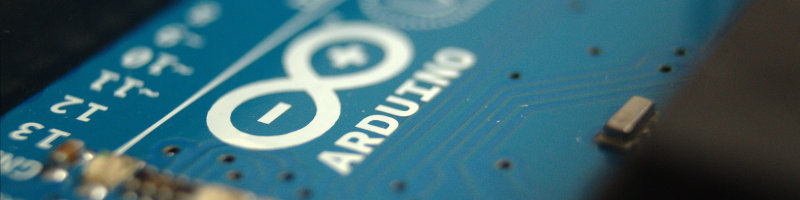
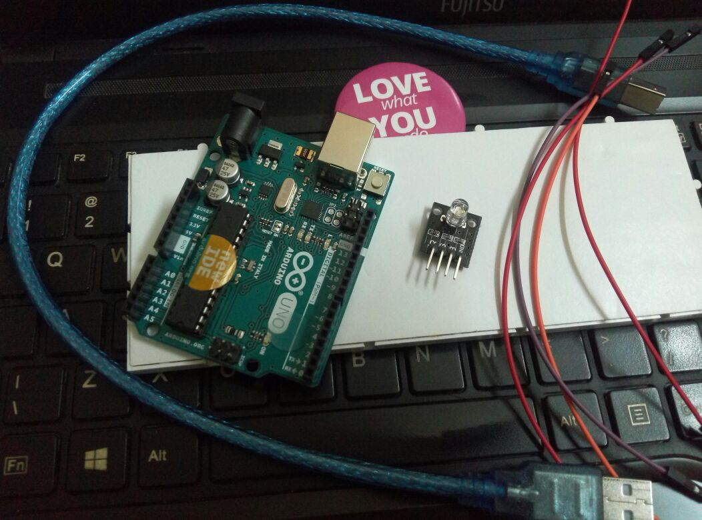
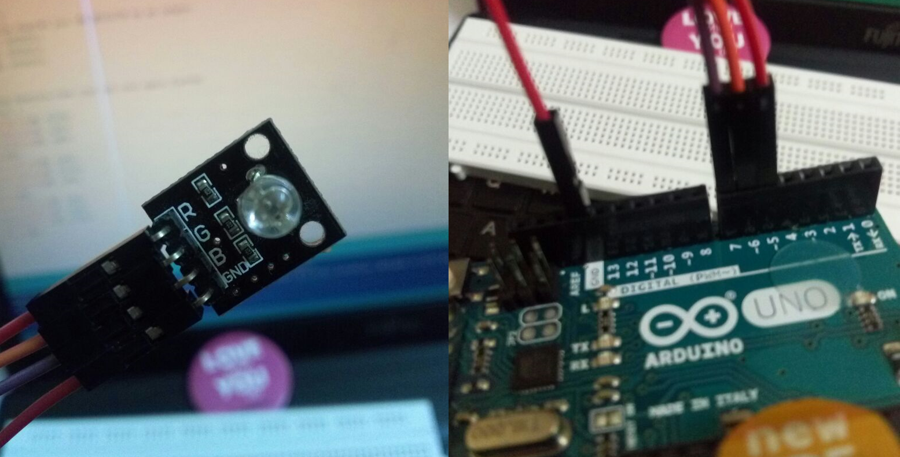
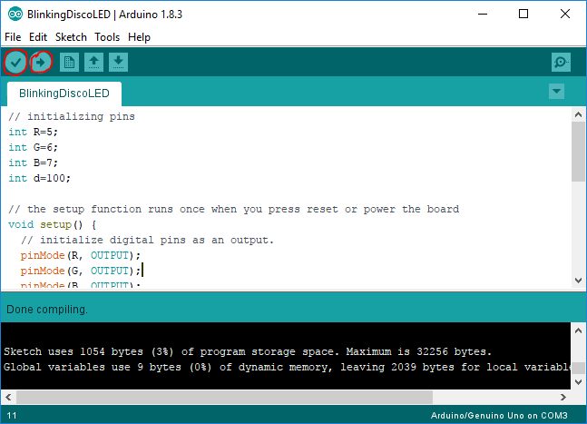
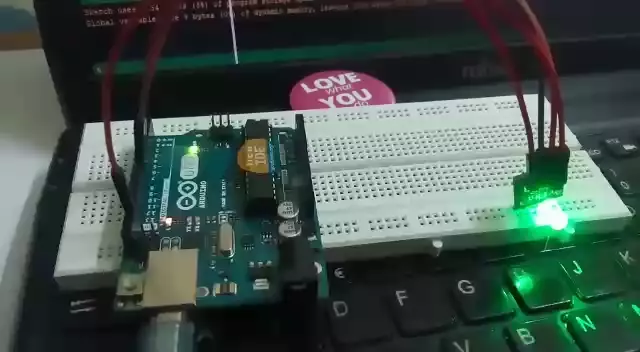

# Arduino 101 with Blinking Disco LED



This is a beginner level Arduino DIY. I have tweaked Arduino blinking LED example with a Tri-color LED, and made it as Disco LED. ;)

You need Arduino environment setup, Install Arduino IDE in your machine(if not already) and connect your Arduino board (I’m using Arduino UNO). Along with board you need 4 jumper wires, 1 tri-color LED (or 3 LEDs, you need to connect 330Ω if it is a normal LED) and breadboard(optional, I not using).



Now connect your Arduino pins 5, 6 & 7 to R, G & B pins of LED respectively, and  connect Ground to any GND pin of Arduino. Follow image below.



Let’s look into code now

```arduino
// initializing pins
int R=5;
int G=6;
int B=7;
int d=100;

// the setup function runs once when you press reset or power the board
void setup() {
  // initialize digital pins as an output.
  pinMode(R, OUTPUT);
  pinMode(G, OUTPUT);
  pinMode(B, OUTPUT);
}

// the loop function runs over and over again forever
void loop() {
  digitalWrite(R, HIGH);           
  digitalWrite(G, LOW);     
  digitalWrite(B, LOW);
  delay(d);
  digitalWrite(R, LOW);           
  digitalWrite(G, HIGH);     
  digitalWrite(B, LOW);
  delay(d);
  digitalWrite(R, LOW);           
  digitalWrite(G, LOW);     
  digitalWrite(B, HIGH);
  delay(d);
}
```

I have taken 3 int R, G & B with value 5,6 & 7 representing digital pins for Red, Green and Blue LEDs. another int d is for delay between each color.

Then we have **setup()** which setting those 3 pins as Output pin **pinMode()** is doing this. In Arduino **setup()** is for initial setup for program. 

While **loop()** is for code which will run repeatedly, I have written code here to turn on one of three LED sequentially in a given delay interval. **HIGH **in **digitalWrite()** is **On,** and **LOW** is **Off.**

Open Arduino IDE, and connect your Arduino board with USB.


Write or copy/paste above code in IDE, now **Compile** it by clicking tick button below File, after successful compiling click **Upload **button to push code into Arduino board.



Congratulations! You are done. You can see you Arduino Disco LED blinking now. You can tweak it further to make it more interesting.



**Cheers!** 