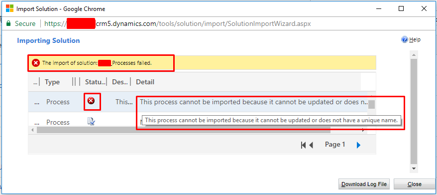

This process cannot be imported because it cannot be updated or does not have a unique name

Have you ever faced this error while importing Dynamics 365 solution containing Business Process Flow

This occurs because BPF implementation is different in Dynamics 365(version 8.2) than previous, you can read more here [https://support.microsoft.com/en-in/help/4020021/after-updating-to-dynamics-365-mismatched-business-process-flow-entity](https://support.microsoft.com/en-in/help/4020021/after-updating-to-dynamics-365-mismatched-business-process-flow-entity)

Solution:

For each BPF, entity will also be generated with same Display Name. Name of entity will be like <Publisher>_BPF_<ProcessId>. You need to include that into your solution and It will be imported successfully.

This resolution is already mentioned in log file of Import solution, you can Download Log File and can see there.

Hope it is helpful.

