# Creating C# Wrapper Over Firebase API For CRUD Operations

Firebase is platform provided by Google, which provides many services, Firebase Realtime Database is one of them. Firebase provides many SDKs for different platforms as well as it provides REST api to interact with database. Here we will built wrapper in C# around REST api to easily perform CRUD operations in our C# applications.

**Section 1: Create App in Firebase Console**

Login to your Firebase account and click on **GO TO CONSOLE** to access console

 

Click on Add Project to add New Firebase Project

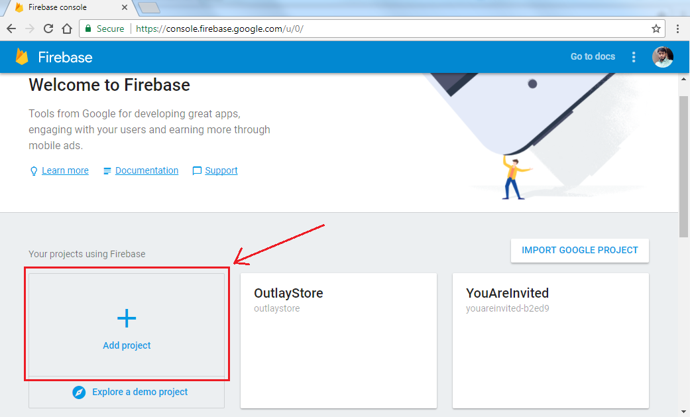

Give Project Name of your choice, your Country/Region and hit **CREATE PROJECT**

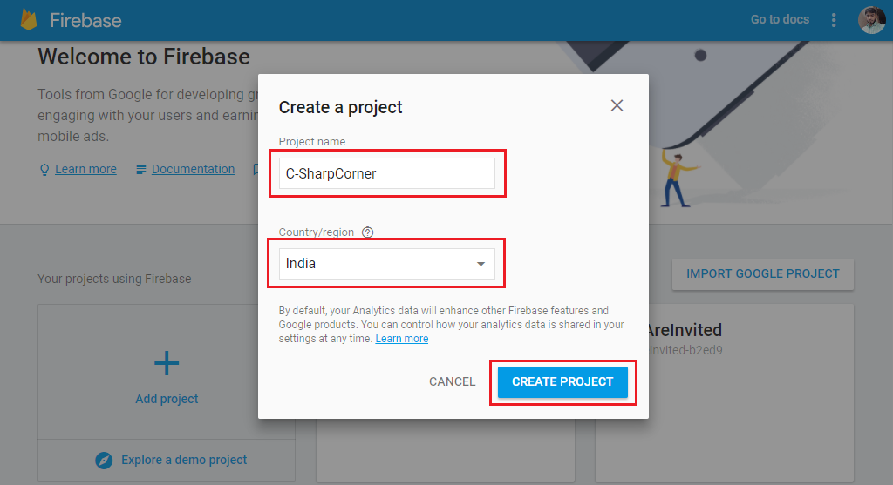

Now you will be navigated to you newly created App Dashboard with all the Firebase features listed, Click on **Database **on left pane

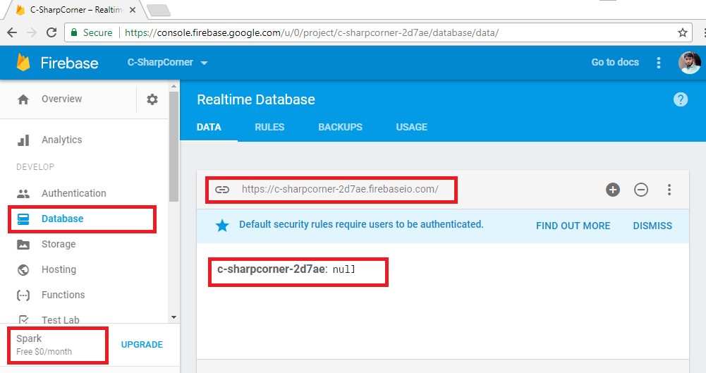

You can see your service plan as Spark which is Free. All data stored is represented as JSON tree. You have Database URL along with root of JSON tree which is null as of now. This database URL will be used to make HTTP request later in article.

**Section 2: Explore Firebase REST API with Postman**

Before making wrapper let’s get comfortable with Firebase REST API with Postman. You can get postman here(https://www.getpostman.com/apps).

Firebase read/write access is secured by default as you can see in **RULES.**


For sake of simplicity in making HTTP requests we will remove authentication for this article.

In upcoming articles we will use with authentication. Make **auth==null;** and hit **PUBLISH** to remove authentication.

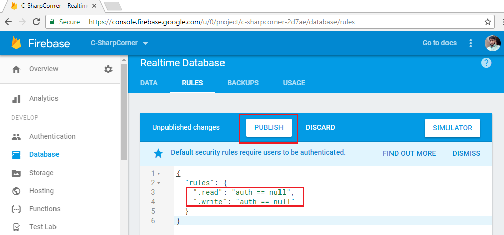

If you are already familiar with Firebase REST API, you can directly jump to Section 3. 

**Writing Data with PUT**

I have some data about a team and it’s members as follows, we are writing this data to root node of our database JSON tree.

```javascript
{
  "Team-Awesome": {
    "Members": {
      "M1": {
        "City": "Hyderabad",
        "Name": "Ashish"
      },
      "M2": {
        "City": "Cyberabad",
        "Name": "Vivek"
      },
      "M3": {
        "City": "Secunderabad",
        "Name": "Pradeep"
      }
    }
  }
}
```

In Postman window set method as **PUT, **in URL enter your database URL appended with **.json **as we are writing to root node. **.json suffix** is always required if we are making REST calls. In **Body **select **raw **and paste your json data there, hit **Send **now to make the request.

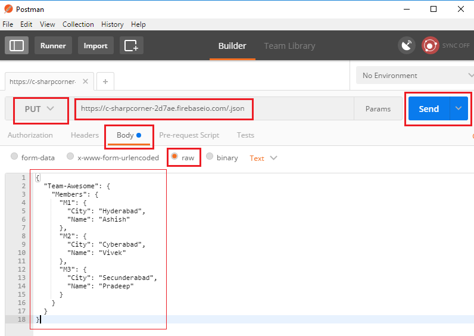

 You can see response code **200 OK** in Postman instead of 201 Created, but this is how Firebase returns it, every request will return 200 OK if successful irrespective of Request method.


Created data will be immediately reflect to your app console, you can verify it.

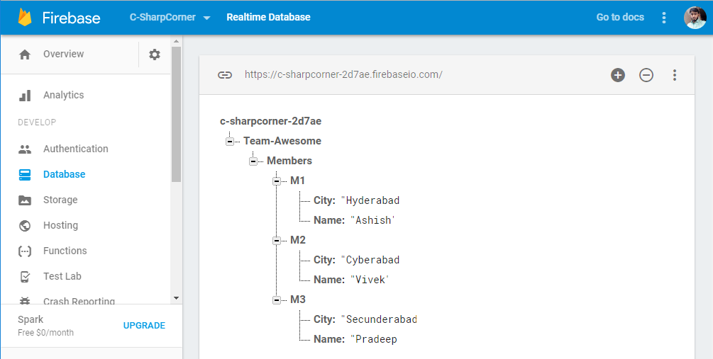

**Reading Data with GET**

To read data we can give path to specific node which we wish to read, here I just want details of Member M1 so I have given specific path in URL. Set method as GET and hit Send to retrieve data.

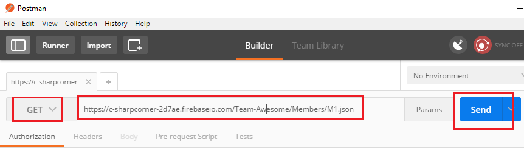

It would return the details of specific member.

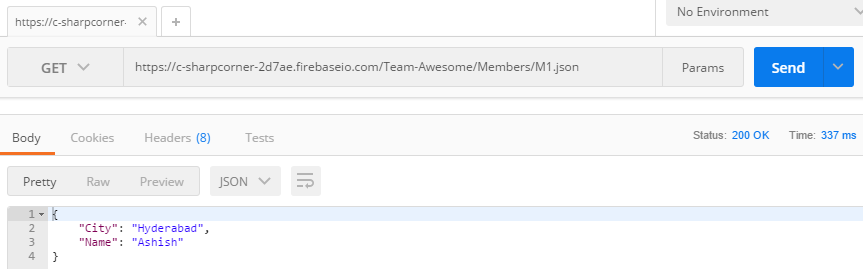

**Pushing Data with POST**

In Firebase POST pushes data to specific node with autogenerated key, it never replaces existing data.

Here we are adding scores for all team members, so our node is **Scores **here which is not already available in JSON tree. Firebase will automatically create it. 


You can see in console **Scores** node is created and data is added along with random keys.


**Updating Data with PATCH**

To update data in a node we have to use PATCH, it can be used to add new fields also. Here we will update city of a member.

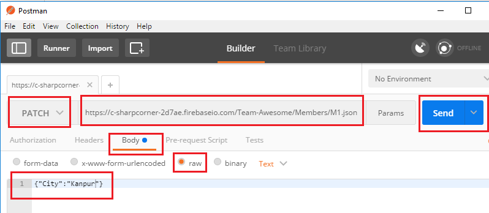

You can observe in console whether value is updated.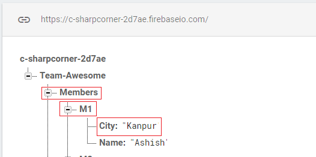

**Removing Data with DELETE**

To remove a resource **DELETE** is used. Let’s delete Member M3.

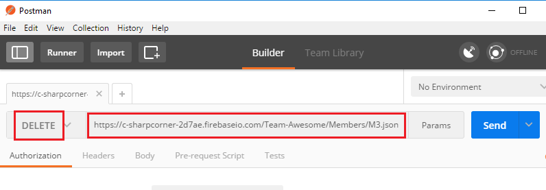

Member M3 is removed, can be seen in console.

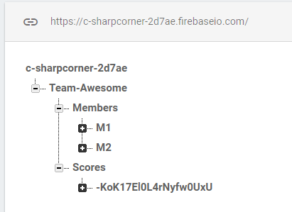

**Section 3: Building C# wrapper**

Add new project of type Class Library with name **FirebaseNet**, or name of your choice.

I have taken .Net Standard here for broader compatibility, you can take .Net framework class library is it’s not available. 

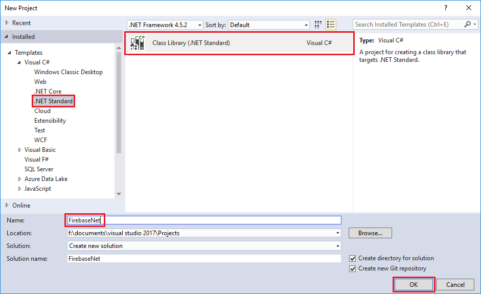

Create folder Database, and Add 4 classes as follows.

1. FirebaseDB.cs

2. FirebaseRequest.cs

3. FirebaseResponse.cs

4. UtilityHelper.cs

Let’s look into each file one by one.

**FirebaseDB.cs**

```csharp
namespace FirebaseNet.Database
{
    using System;
    using System.Net.Http;
    /// <summary>
    /// FirebasDB Class is reference of a Firebase Database
    /// </summary>
    public class FirebaseDB
    {
        /// <summary>
        /// Initializes a new instance of the <see cref="FirebaseDB"/> class with base url of Firebase Database
        /// </summary>
        /// <param name="baseURL">Firebase Database URL</param>
        public FirebaseDB(string baseURL)
        {
            this.RootNode = baseURL;
        }
		
        /// <summary>
        /// Gets or sets Represents current full path of a Firebase Database resource
        /// </summary>
        private string RootNode { get; set; }
        
        /// <summary>
        /// Adds more node to base URL
        /// </summary>
        /// <param name="node">Single node of Firebase DB</param>
        /// <returns>Instance of FirebaseDB</returns>
        public FirebaseDB Node(string node)
        {
            if (node.Contains("/"))
            {
                throw new FormatException("Node must not contain '/', use NodePath instead.");
            }
            return new FirebaseDB(this.RootNode + '/' + node);
        }

        /// <summary>
        /// Adds more nodes to base URL
        /// </summary>
        /// <param name="nodePath">Nodepath of Firebase DB</param>
        /// <returns>Instance of FirebaseDB</returns>
        public FirebaseDB NodePath(string nodePath)
        {
            return new FirebaseDB(this.RootNode + '/' + nodePath);
        }

        /// <summary>
        /// Make Get request
        /// </summary>
        /// <returns>Firebase Response</returns>
        public FirebaseResponse Get()
        {
            return new FirebaseRequest(HttpMethod.Get, this.RootNode).Execute();
        }

        /// <summary>
        /// Make Put request
        /// </summary>
        /// <param name="jsonData">JSON string to PUT</param>
        /// <returns>Firebase Response</returns>
        public FirebaseResponse Put(string jsonData)
        {
            return new FirebaseRequest(HttpMethod.Put, this.RootNode, jsonData).Execute();
        }

        /// <summary>
        /// Make Post request
        /// </summary>
        /// <param name="jsonData">JSON string to POST</param>
        /// <returns>Firebase Response</returns>
        public FirebaseResponse Post(string jsonData)
        {
            return new FirebaseRequest(HttpMethod.Post, this.RootNode, jsonData).Execute();
        }

        /// <summary>
        /// Make Patch request
        /// </summary>
        /// <param name="jsonData">JSON sting to PATCH</param>
        /// <returns>Firebase Response</returns>
        public FirebaseResponse Patch(string jsonData)
        {
            return new FirebaseRequest(new HttpMethod("PATCH"), this.RootNode, jsonData).Execute();
        }

        /// <summary>
        /// Make Delete request
        /// </summary>
        /// <returns>Firebase Response</returns>
        public FirebaseResponse Delete()
        {
            return new FirebaseRequest(HttpMethod.Delete, this.RootNode).Execute();
        }

        /// <summary>
        /// To String
        /// </summary>
        /// <returns>Current resource URL as string</returns>
        public override string ToString()
        {
            return this.RootNode;
        }
    }
}
```

**FirebaseDB** is main class user interacts with, it exposes the API to be consumed by user of library.

It’s constructor takes baseURI of Firebase Database as parameter and assigns to RootNode private property.

Class is using **Method Chaining** to maintain resource URI with the help of **Node **&** NodePath** methods. They are taking string as input and appending to **RootNode** and returns FirebaseDB object with combined URI. Here **Node** can take only single node whether **NodePath** is for multiple Nodes.

Class has methods for each Firebase supported method which are returning **FirebaseResponse** object. **Put, Post **&** Patch** methods are having parameter to accept JSON data as string. They all are instantiating **FirebaseRequest** with HttpMethod object according to method, resource URI as RootNode and optional parameter jsonData  as string.

**ToString()** is overridden here to return current resource URI.

**FirebaseRequest.cs**

```csharp
namespace FirebaseNet.Database
{
    using System;
    using System.Net.Http;
	
    /// <summary>
    /// Firebase Request
    /// </summary>
    class FirebaseRequest
    {
        /// <summary>
        /// Suffix to be added in each resource URI
        /// </summary>
        private const string JSON_SUFFIX = ".json";

        /// <summary>
        /// Initializes a new instance of the <see cref="FirebaseRequest"/> class
        /// </summary>
        /// <param name="method">HTTP Method</param>
        /// <param name="uri">URI of resource</param>
        /// <param name="jsonString">JSON string</param>
        public FirebaseRequest(HttpMethod method, string uri, string jsonString = null)
        {
            this.Method = method;
            this.JSON = jsonString;
            if (uri.Replace("/", string.Empty).EndsWith("firebaseio.com"))
            {
                this.Uri = uri + '/' + JSON_SUFFIX;
            }
            else
            {
                this.Uri = uri + JSON_SUFFIX;
            }
        }
		
        /// <summary>
        /// Gets or sets HTTP Method
        /// </summary>
        private HttpMethod Method { get; set; }

        /// <summary>
        /// Gets or sets JSON string
        /// </summary>
        private string JSON { get; set; }

        /// <summary>
        /// Gets or sets URI
        /// </summary>
        private string Uri { get; set; }

        /// <summary>
        /// Executes a HTTP requests
        /// </summary>
        /// <returns>Firebase Response</returns>
        public FirebaseResponse Execute()
        {
            Uri requestURI;
            if (UtilityHelper.ValidateURI(this.Uri))
            {
                requestURI = new Uri(this.Uri);
            }
            else
            {
                return new FirebaseResponse(false, "Proided Firebase path is not a valid HTTP/S URL");
            }

            string json = null;
            if (this.JSON != null)
            {
                if (!UtilityHelper.TryParseJSON(this.JSON, out json))
                {
                    return new FirebaseResponse(false, string.Format("Invalid JSON : {0}", json));
                }
            }

            var response = UtilityHelper.RequestHelper(this.Method, requestURI, json);
            response.Wait();
            var result = response.Result;
            var firebaseResponse = new FirebaseResponse()
            {
                HttpResponse = result,
                ErrorMessage = result.StatusCode.ToString() + " : " + result.ReasonPhrase,
                Success = response.Result.IsSuccessStatusCode
            };
			
             if (this.Method.Equals(HttpMethod.Get))
            {
                var content = result.Content.ReadAsStringAsync();
                content.Wait();
                firebaseResponse.JSONContent = content.Result;
            }

            return firebaseResponse;
        }
    }
}
```

**FirebaseRequet** class is where actual business happen. **Constructor **takes Http Method, Firebase URI and optional JSON data as parameter. As well as append **.json** to URI which is necessary to make REST calls, In base base URI it should be **/.json** while URI with any Node needs only **.json** to be appended.

**Execute()** is responsible for making HTTP calls with help of **RequestHelper** method of **UtilityHelper **class. It validates URI and JSON data, if invalid it returns **FirebaseResponse** with **Success=False** and proper **ErrorMessage.**

If all parameters are valid, it makes HTTP calls, and forms FirebaseResponse object and returns it. If Request if of type GET then it parses response to string and appends it to FirebaseResponse object to be returned to caller.

**RequestHelper()** is an Asynchronous method, which is returning **Task<HttpResponseMessage>,** but in Execute method with use of **Wait() **and **Result** we are handling it synchronously. In further enhancement Asynchronous API will also be exposed to consumer.

**FirebaseResponse.cs**

```csharp
namespace FirebaseNet.Database
{
    using System.Net.Http;

    /// <summary>
    /// Firebase Response
    /// </summary>
    public class FirebaseResponse
    {
        /// <summary>
        /// Initializes a new instance of the <see cref="FirebaseResponse"/> class
        /// </summary>
        public FirebaseResponse()
        {
        }

        /// <summary>
        /// Initializes a new instance of the <see cref="FirebaseResponse"/> class
        /// </summary>
        /// <param name="success">If Success</param>
        /// <param name="errorMessage">Error Message</param>
        /// <param name="httpResponse">HTTP Response</param>
        /// <param name="jsonContent">JSON Content</param>
        public FirebaseResponse(bool success, string errorMessage, HttpResponseMessage httpResponse = null, string jsonContent = null)
        {
            this.Success = success;
            this.JSONContent = jsonContent;
            this.ErrorMessage = errorMessage;
            this.HttpResponse = httpResponse;
        }

        /// <summary>
        /// Gets or sets Boolean status of Success
        /// </summary>
        public bool Success { get; set; }

        /// <summary>
        /// Gets or sets JSON content returned by the Request
        /// </summary>
        public string JSONContent { get; set; }

        /// <summary>
        /// Gets or sets Error Message if Any
        /// </summary>
        public string ErrorMessage { get; set; }

        /// <summary>
        /// Gets or sets full Http Response
        /// </summary>
        public HttpResponseMessage HttpResponse { get; set; }
    }
}
```

**FirebaseResponse** represents output of API calls against **FirebaseDB**. It contains 4 public properties as follows.

1. Success

2. JSONContent

3. ErrorMessage

4. HttpResponse

 In Firebase.Net I have tried to not surprise the consumer by throwing any unexpected error, so FirebaseResponse has boolean property **Success**, which tells you whether call is successful or not along with proper message with **ErrorMessage** property.

Error will not always be a Http Error, it could be related to invalid JSON or improper URI also, they both are handled here.

If HTTP call is successful **Success** will have True, ErrorMessage will be null, **HttpResponse **will contain complete **HttpResponseMessage **and if request type is **GET **then **JSONContent **will contain the response as string.

**UtilityHelper.cs**

```csharp
namespace FirebaseNet.Database
{
    using System;
    using System.Net.Http;
    using System.Text;
    using System.Threading.Tasks;
    using Newtonsoft.Json.Linq;

    /// <summary>
    /// Utility Helper Class
    /// </summary>
    class UtilityHelper
    {
        /// <summary>
        /// User Agent Header in HTTP Request
        /// </summary>
        private const string USER_AGENT = "firebase-net/1.0";

        /// <summary>
        /// Validates a URI
        /// </summary>
        /// <param name="url">URI as string</param>
        /// <returns>True if valid</returns>
        public static bool ValidateURI(string url)
        {
            Uri locurl;
            if (System.Uri.TryCreate(url, UriKind.RelativeOrAbsolute, out locurl))
            {
                if (
                    !(locurl.IsAbsoluteUri &&
                      (locurl.Scheme == "http" || locurl.Scheme == "https")) ||
                    !locurl.IsAbsoluteUri)
                {
                    return false;
                }
            }
            else
            {
                return false;
            }
			
            return true;
        }

        /// <summary>
        /// Validates JSON string
        /// </summary>
        /// <param name="inJSON">JSON to be validatedd</param>
        /// <param name="output">Valid JSON or Error Message</param>
        /// <returns>True if valid</returns>
        public static bool TryParseJSON(string inJSON, out string output)
        {
            try
            {
                JToken parsedJSON = JToken.Parse(inJSON);
                output = parsedJSON.ToString();
                return true;
            }
            catch (Exception ex)
            {
                output = ex.Message;
                return false;
            }
        }
		
        /// <summary>
        /// Makes Asynchronus HTTP requests
        /// </summary>
        /// <param name="method">HTTP method</param>
        /// <param name="uri">URI of resource</param>
        /// <param name="json">JSON string</param>
        /// <returns>HTTP Responce as Task</returns>
        public static Task<HttpResponseMessage> RequestHelper(HttpMethod method, Uri uri, string json = null)
        {
            var client = new HttpClient();
            var msg = new HttpRequestMessage(method, uri);
            msg.Headers.Add("user-agent", USER_AGENT);
            if (json != null)
            {
                msg.Content = new StringContent(
                    json,
                    UnicodeEncoding.UTF8,
                    "application/json");
            }

            return client.SendAsync(msg);
        }
    }
}
```

**UtilityHelper** contains 3 static methods to keep our keep running.

**ValidateURI()** takes URI as string and validates it using **TryCreate() **of **Uri** class and returns Boolean.

**TryParseJSON()** validates and **format** JSON string, Firebase does not allow JSON which uses single quotes instead of double quotes, but in C# most people will pass in single quotes because of multiline support, very few will use escape character for double quotes. That’s why I’m parsing it which validates JSON as well as calling ToString() on JToken object will returns me well formatted JSON in double quotes.

 If valid returns **True **and out parameter output contains **Formatted JSON**. 

If invalid then returns **False** and out parameter output contains **Error Message.**

**Section 4: Library in Action**

Let’s consume our newly created library and see how it works. Create New Console App and give name of your choice.

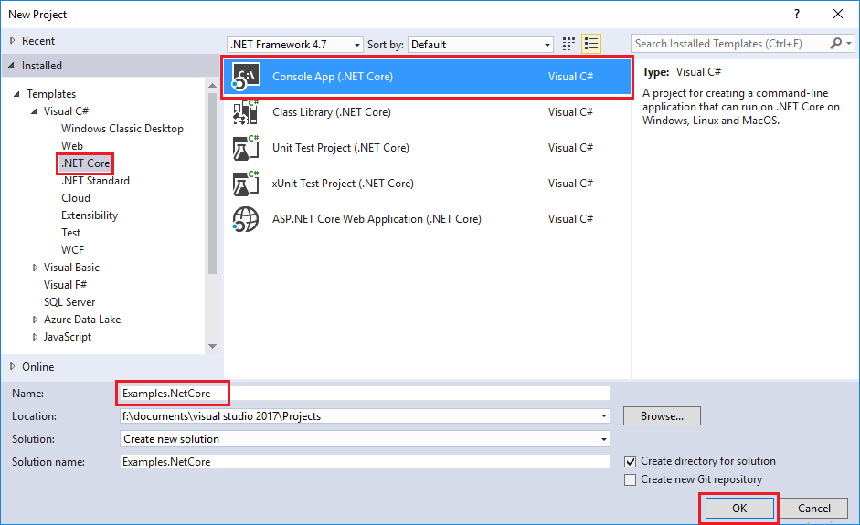

Now update your Program.cs with following code**.**

**Program.cs**

```csharp
namespace Examples.NetCore
{
    using FirebaseNet.Database;
    using static System.Console;

    /// <summary>
    /// Examples
    /// </summary>
    public class Program
    {
        /// <summary>
        /// Main Method
        /// </summary>
        public static void Main()
        {
            // Instanciating with base URL
            FirebaseDB firebaseDB = new FirebaseDB("https://c-sharpcorner-2d7ae.firebaseio.com");
            
			// Referring to Node with name "Teams"
            FirebaseDB firebaseDBTeams = firebaseDB.Node("Teams");

            var data = @"{
                            'Team-Awesome': {
                                'Members': {
                                    'M1': {
                                        'City': 'Hyderabad',
                                        'Name': 'Ashish'
                                        },
                                    'M2': {
                                        'City': 'Cyberabad',
                                        'Name': 'Vivek'
                                        },
                                    'M3': {
                                        'City': 'Secunderabad',
                                        'Name': 'Pradeep'
                                        }
                                   }
                               }
                          }";

            WriteLine("GET Request");
            FirebaseResponse getResponse = firebaseDBTeams.Get();
            WriteLine(getResponse.Success);
			if(getResponse.Success)
            	WriteLine(getResponse.JSONContent);
            WriteLine();

            WriteLine("PUT Request");
            FirebaseResponse putResponse = firebaseDBTeams.Put(data);
            WriteLine(putResponse.Success);
            WriteLine();

            WriteLine("POST Request");
            FirebaseResponse postResponse = firebaseDBTeams.Post(data);
            WriteLine(postResponse.Success);
            WriteLine();

            WriteLine("PATCH Request");
            FirebaseResponse patchResponse = firebaseDBTeams
                // Use of NodePath to refer path lnager than a single Node
                .NodePath("Team-Awesome/Members/M1")
                .Patch("{\"Designation\":\"CRM Consultant\"}");
            WriteLine(patchResponse.Success);
            WriteLine();

            WriteLine("DELETE Request");
            FirebaseResponse deleteResponse = firebaseDBTeams.Delete();
            WriteLine(deleteResponse.Success);
            WriteLine();

            WriteLine(firebaseDBTeams.ToString());

            ReadLine();
        }
    }
}
```

**Execution**

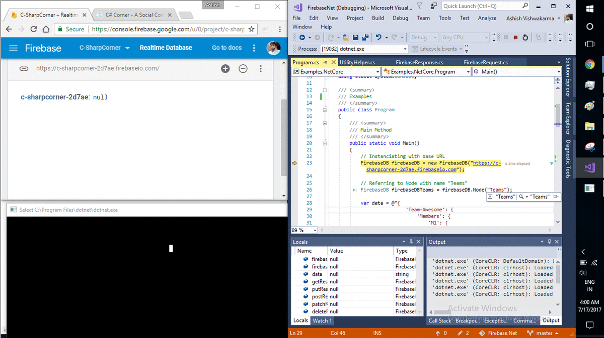

Here I am calling all the methods in API. First I am instantiating **FirebaseDB** object with base URI of my Firebase App, you may replace it with your App URI. Then in next line **Node("Teams") **is used to point object to a different resource URI. “Teams” don’t need to be already available in your Firebase database.

Then we have some JSON data in which is a multiline JSON string using single quotes, It is supported in Library but not by Firebase. So you can use it here.

Next we have **Get() **call, which is returning **FirebaseResponse **in **getResponse **it is always a good idea to verify **getResponse.Success** before calling **getResponse.JSONContent.**

Now we are calling **Put() **&** Post()** with given data, behaviour of these HTTP calls is already described in Section 2.

**Patch()** is interesting here because of 2 reasons, First it is used along with **NodePath()** which is accessing 3 nodes depth. And second JSON data is passed using escape characters for double quotes, which is how Firebase actually accepts data.

Now **Delete()** getting called method which deletes complete JSON tree at given URI.

Finally **ToString()** method prints current resource URI of Firebase Database.

I will be keep adding new features to this library, you can see in further articles and repo or you can contribute at [https://github.com/AshV/Firebase.Net](https://github.com/AshV/Firebase.Net)

