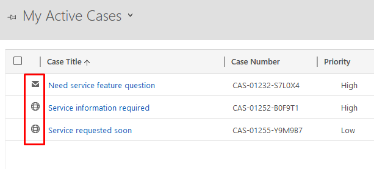
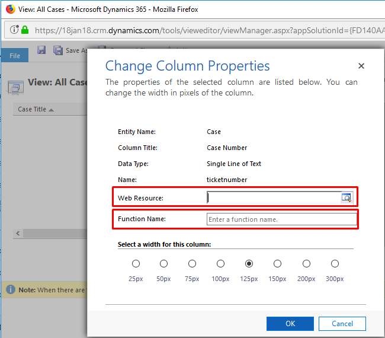
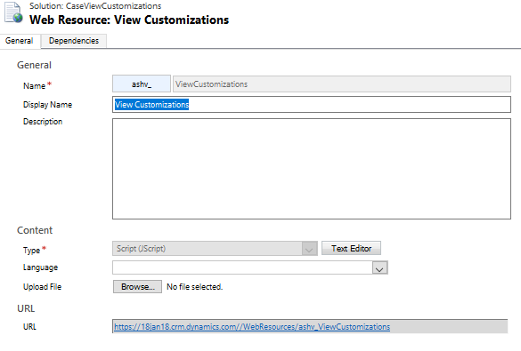
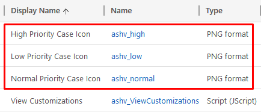

# Draft

# Customize Views with Javascript in Dynamics 365

Dynamics 365 v9.0 onwards JavaScript scripting is not only limited to Forms, you can even customize views. More specifically you can just add icon in cells as of now, I was expecting more features actually but it didn’t have.


### What is Offered?
> 

As you can see in above image, those icons in vies cells were already avialble in some OOB views, now you can use in custom view as well.

### Where to customize?
> 
Goto any view's property, you can see 2 new fields **Web Resource** and **Function Name**, which is very similar to Forms when you write JS.

### What to write in Web Resource?
You need to write a JS function with 2 parameters, when you'll add it to view, first parameters will recieve **rowData**(value with metadata shown below for one cell) and **userLCID**(i.e. language code fof current user).
Based on those 2 inputs you can decide what icon to show. And name of this function goes in **Function Name:** field in View's property.

```json
/// rowData for just one cell
{
   "RowId":"{B69E62A8-90DF-E311-9565-A45D36FC5FE8}",
   "RowType":"112",
   "title":"Average order shipment time",
   "title_Value":"Average order shipment time",
   "ticketnumber":"CAS-01213-P8B3X0",
   "ticketnumber_Value":"CAS-01213-P8B3X0",
   "prioritycode":"Normal",
   "prioritycode_Value":2,
   "caseorigincode":"Web",
   "caseorigincode_Value":3,
   "customerid":"Litware",
   "customerid_Value":{
      "Data":{
         "Type":1,
         "Name":"Litware",
         "ID":"{BCA19CDD-88DF-E311-B8E5-6C3BE5A8B200}",
         "Dsc":0
      },
      "NeedsIconRendering":false
   },
   "ownerid":"Christa Geller (Sample Data)",
   "ownerid_Value":{
      "Data":{
         "Type":8,
         "Name":"Christa Geller (Sample Data)",
         "ID":"{C02D43FF-16A8-4E1E-8DD1-0B78EB058AB4}",
         "Dsc":0
      },
      "NeedsIconRendering":false
   },
   "statecode":"Active",
   "statecode_Value":"Active",
   "createdon":"1/21/2017 4:20 AM",
   "createdon_Value":"2017-01-21T04:20:45+00:00",
   "processid":"{0FFBCDE4-61C1-4355-AA89-AA1D7B2B8792}",
   "processid_Value":"0ffbcde4-61c1-4355-aa89-aa1d7b2b8792",
   "processts":"424505",
   "processts_Value":null,
   "processid_Hidden":"0ffbcde4-61c1-4355-aa89-aa1d7b2b8792",
   "processts_Hidden":"424505"
}
```

### Let's Implement
I’ll be doing all the customizations in **All Cases** view of **Case** entity. So you can try it right away in new trial instance without creating any custom entity/view.

Add one JS web resource 
> 

And write below code in it
```javascript
function casePriorityIcons(rowData, userLCID) {
  var data = JSON.parse(rowData);
  var priority = data.prioritycode;
  var imgWebResource = "";
  var imgTooltip = "";
  switch (priority) {
    case "High":
      imgWebResource = "ashv_high";
      imgTooltip = "{High Priority Case}";
      break;
    case "Low":
      imgWebResource = "ashv_low";
      imgTooltip = "{Low Priority Case}";
      break;
    default:
      imgWebResource = "ashv_normal";
      imgTooltip = "{Normal Priority Case}";
      break;
  }
  return [imgWebResource, imgTooltip];
}
```
> 

In above code I'm reading cell data which is priority field of case, and according to value it will show color icon in fron of it. I have added three 16x16(if you'll take different size it will be scaled back to 16x16, so better take optimized size) icons with color Red, Yellow & Green for High, Normal & Low priorities respectively.
Function returns an array of size 2, first element tells name of image web resource to show and second is tooltip text.
You can use below images in your web resource.

High :  | Normal :  | Low : 
