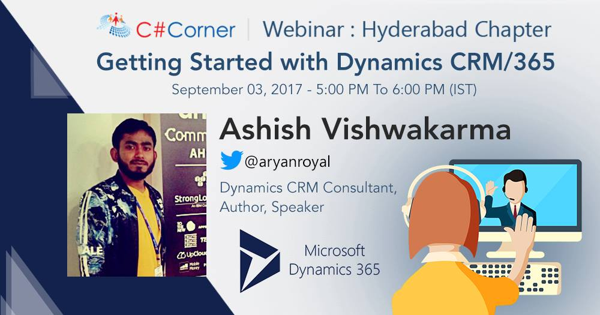

# Getting Started With Dynamics 365 - Webinar Content

Sharing content for [webinar](https://www.c-sharpcorner.com/events/getting-started-with-dynamics-crm365) organized by [C# Corner](http://c-sharpcorner.com/) on September 3, 2017

> Targetted audience for this webinar were .Net developers who wanted to get started with Dynamics 365/CRM Development

### Slides
<iframe src="//slides.com/ashv/dynamics-365-101/embed?style=light" width="100%" scrolling="no" frameborder="0" webkitallowfullscreen mozallowfullscreen allowfullscreen></iframe>

[Getting Started With Dynamics 365 Slides](http://slides.com/ashv/dynamics-365-101#/)

### Code Used in Webinar
[https://github.com/AshV/CrmSdkDemo](https://github.com/AshV/CrmSdkDemo)

### Event URL
[Getting Started With Dynamics 365 Webinar](https://www.c-sharpcorner.com/events/getting-started-with-dynamics-crm365)
