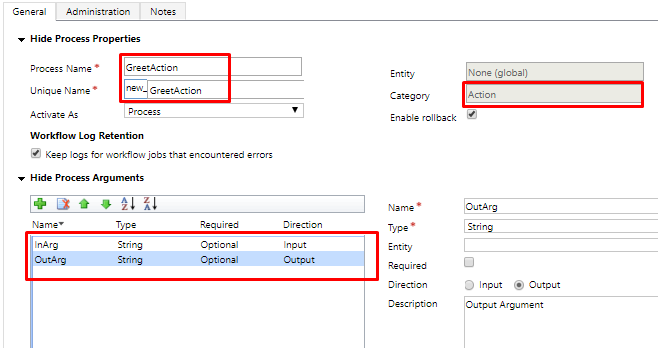
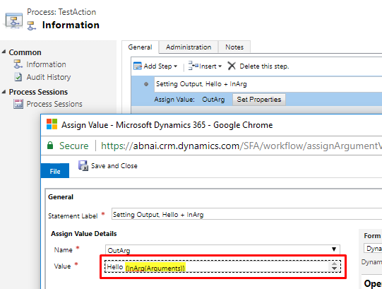

# Executing Actions using JavaScript / C# in Dynamics 365

In Dynamics 365 Actions we have feasiblilty to triggers it from Clientside code and Serverside code both. Let's have a look how it can be achieved.

I have created  an action with name new_GreetAction(see images below) it's a global action and has Input and Output Argumant both. We will see how to call it programmatically.




## Calling Actions using C\#

In C\# we can call it using **OrganizationRequest** and setting RequestName parameter or from constructor.

```csharp
// calling action
var executeAction = orgService.Execute(
    new OrganizationRequest("new_GreetAction") {
        Parameters = {
            { "InArg", "Ashish" }
        }
    });
```

To read output arguments you can pass argument name in indexer.

```csharp
//Reading output arguments
var OutArg = executeAction["OutArg"];
```

If your action is **Not Global Action** then you can pass targettiing record in **Target** parameter, and yes you can pass parametrs as indexer also.

```csharp
var executeAction = orgService.Execute(
    new OrganizationRequest()
    {
        RequestName = "new_GreetAction",
        ["Target"] = new EntityReference("logcal name", new Guid("guid of record")),
        ["InArgument"] = "Value"
    });
```

## Calling Actions using JavaScript Ajax

It's really easy with [CRMRESTBuilder](https://github.com/jlattimer/CRMRESTBuilder) see generated code below.

```javascript
var parameters = {};
parameters.InArg = "Ashish";

var req = new XMLHttpRequest();
req.open("POST", Xrm.Page.context.getClientUrl() + "/api/data/v9.0/new_GreetAction", true);
req.setRequestHeader("OData-MaxVersion", "4.0");
req.setRequestHeader("OData-Version", "4.0");
req.setRequestHeader("Accept", "application/json");
req.setRequestHeader("Content-Type", "application/json; charset=utf-8");
req.onreadystatechange = function() {
    if (this.readyState === 4) {
        req.onreadystatechange = null;
        if (this.status === 200) {
            var results = JSON.parse(this.response);
            alert(results.OutArg)
        } else {
            Xrm.Utility.alertDialog(this.statusText);
        }
    }
};
req.send(JSON.stringify(parameters));
```

## Making Request in modern way using Fetch

```javascript
var clientUrl = Xrm.Page.context.getClientUrl();
var parameters = {};
parameters.InArg = "Ashish";

fetch(
    clientUrl + "/api/data/v9.0/new_GreetAction",
    {
     body:JSON.stringify(parameters),
        headers: {
            "Accept": "application/json",
            "Content-Type": "application/json; charset=utf-8",
            "OData-MaxVersion": "4.0",
            "OData-Version": "4.0"
        },
        credentials: "same-origin",
        method: "POST"
    })
    .then(response => console.log("Success:", response))
    .catch(error => console.error("Error:", error));
```