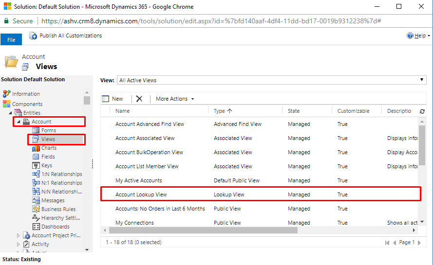
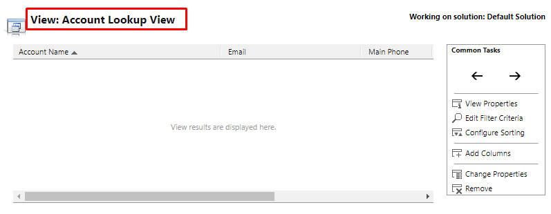
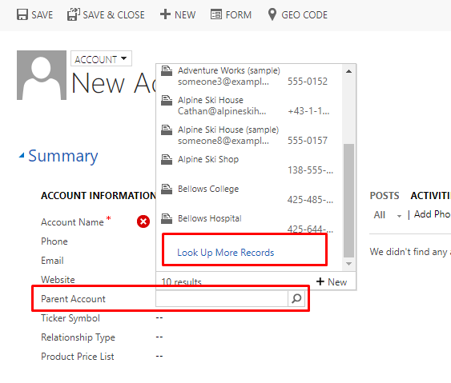
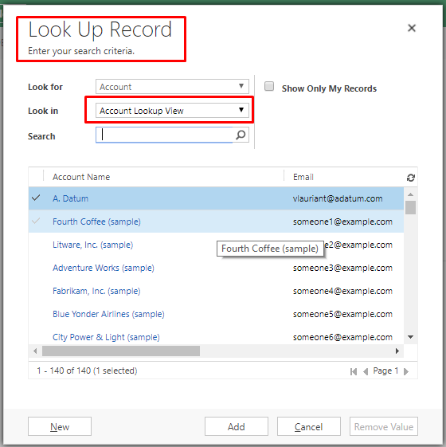
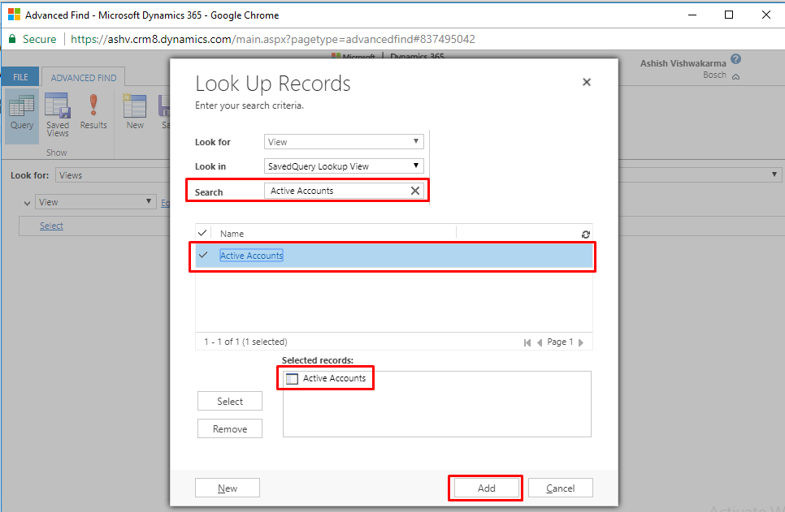
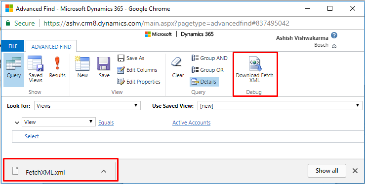
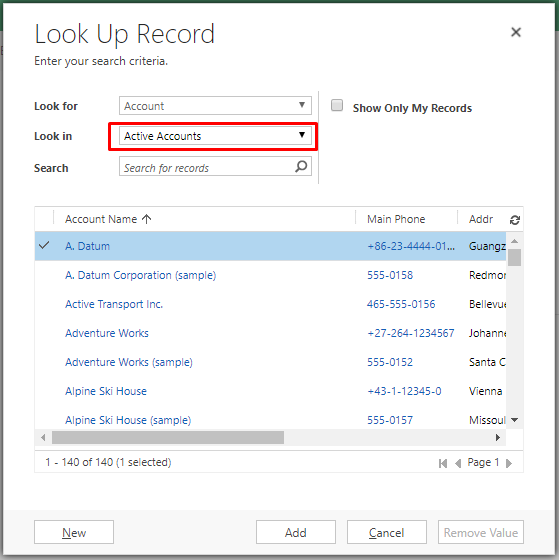

**Selecting Lookup View dynamically using JavaScript in Dynamics CRM/365**

Lookup Views are shown when user clicks on Look Up More Records in any Lookup Field. In Dynamics CRM/365, Lookup Views are available in almost all entities, In newly created custom entities also it will be available by default. Lookup View of Account Entity is shown.

Parent Account field is a Lookup in Account, you can see Lookup View here

Now If we want to show some other view here by default,** **setDeafautView() method does our job. See the syntax below.

Xrm.Page.getControl("<ControlName>").setDefaultView("<ViewGUID>");

Now the question is how to get View Id, well Advanced Find is here to rescue.

Select Look for as **View** and condition as **Equals.**

Select your desired View from Lookup. It must belong to your Entity otherwise it won’t show any error but won’t work also, I am taking **Active Accounts** view Here.

Download and Open Fetch XML

You can find View ID here. Which is {00000000-0000-0000-00AA-000010001002} for me.

<fetch version="1.0" output-format="xml-platform" mapping="logical" distinct="false">

  <entity name="savedquery">

    <attribute name="name" />

    <attribute name="description" />

    <attribute name="savedqueryid" />

    <order attribute="name" descending="false" />

    <filter type="and">

      <condition attribute="savedqueryid" operator="eq" uiname="Active Accounts" uitype="savedquery" value="{00000000-0000-0000-00AA-000010001002}" />

    </filter>

  </entity>

</fetch>

Let’s use this in setDefaultView() and use in Form. I am setting this to Parent Account of Account Main Form onLoad event. Add below code to JS web resource and Add to Form.

function formOnLoad(){

Xrm.Page.getControl("parentaccountid").setDefaultView("{00000000-0000-0000-00AA-000010001002}");

}

Attach function to Form OnLoad event, Then Save & Publish it.

 

Now go back to Account Form, refresh it to Load JavaScript, and in **Parent Account** click **Look Up More Records**. 

Congrats! Your default Lookup View is **Active Accounts** now.

Let’s make it more generic and useful by retrieving View Id from name with WebApi Ajax call.

I’m creating new generic function with name **setLookupViewByName()** replace your web resource content with below given code, save and publish it.

function formOnLoad() {

    setLookupViewByName("parentaccountid", "Customers", true);

}

function setLookupViewByName(fieldName, viewName, asynchronous) {

    var req = new XMLHttpRequest();

    req.open("GET", Xrm.Page.context.getClientUrl() + "/api/data/v8.2/savedqueries?$select=savedqueryid&$filter=name eq '" + viewName + "'", asynchronous);

    req.setRequestHeader("OData-MaxVersion", "4.0");

    req.setRequestHeader("OData-Version", "4.0");

    req.setRequestHeader("Accept", "application/json");

    req.setRequestHeader("Content-Type", "application/json; charset=utf-8");

    req.setRequestHeader("Prefer", "odata.include-annotations=\"*\"");

    req.onreadystatechange = function () {

        if (this.readyState === 4) {

            req.onreadystatechange = null;

            if (this.status === 200) {

                var results = JSON.parse(this.response);

                if (results.value.length > 0) {

                    var savedqueryid = results.value[0]["savedqueryid"];

                    Xrm.Page.getControl(fieldName).setDefaultView(savedqueryid);

                } else {

                    Xrm.Utility.alertDialog(viewName + " view is not available.");

                }

            } else {

                Xrm.Utility.alertDialog(this.statusText);

            }

        }

    };

    req.send();

}

I have given **Customers **as view name, so it is coming as default view. See in screenshot.

Hope it is helpful. Cheers!

